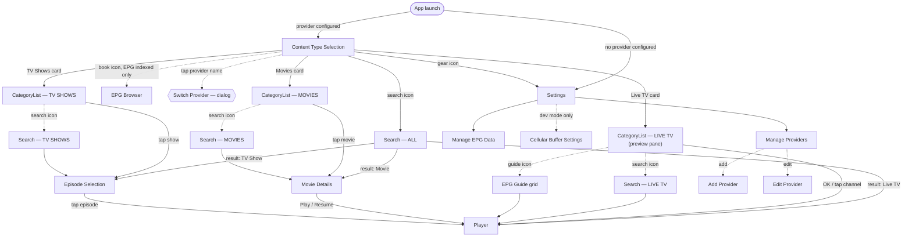

# Home Screen UX Flow Audit

Full map of every path reachable from `ContentTypeSelectionScreen`, on TV and Mobile, plus a
code-grounded friction log and recommendations. Findings are verified against source (file:line),
not inferred from docs.

**Scope:** `ContentTypeSelectionScreen` and everything reachable from it.
**Platforms:** TV (D-pad) and Mobile (touch).
**Source:** `core:navigation/Screen.kt`, `TvNavHost.kt`, `MobileNavHost.kt`, both
`ContentTypeSelectionScreen.kt` implementations.
**Status:** 5 of 6 findings fixed (`4beed037`, `893c2c4e`) — dead provider tap, forced picker for
single-content-type providers, stale EPG icon, the hidden favorite gesture, and the Live TV
back-stopover legibility. One remains open — EPG Guide/Browser naming — and needs a product
decision, not a patch. See §4 for detail per finding.

---

## 1. The map

TV and Mobile share one route graph — same `Screen` definitions, same NavHost shape. The one place
they genuinely diverge is *how* Live TV's preview pane sits on the back stack (see finding on
"Leaving Live TV", below, and `NAVIGATION_GUIDE.md` → "Live TV Preview / Dock Back-Stack").

Solid arrow = standard push. Dashed arrow = conditional, dialog, or secondary entry point.

---

## 2. Inside the player

The player isn't a dead end — several gestures branch out of it without a route change, which is
why they don't show up in the map above. Still real navigation, just local state instead of a
back-stack entry.

| Trigger | TV | Mobile | Result |
|---|---|---|---|
| Switch channel | D-pad Up / Down | Vertical swipe | Live TV only — stream swaps without leaving player |
| Channel list overlay | D-pad Left | Swipe right | Slide-in panel, current category |
| Last watched overlay | D-pad Right | Swipe left | Slide-in panel, history |
| Episode skip | D-pad Left / Right | Swipe | TV Shows only — jumps to adjacent episode, same session |
| Stats overlay | Double-OK | Double-tap | Diagnostics panel, repositionable to 4 corners |
| Favorite | Star action | Star action | Adds to the Favorites virtual category |

---

## 3. Screen by screen

| Screen | Reached from | Leads to | Platform variance |
|---|---|---|---|
| `ContentTypeSelection` | App launch (provider configured) | Search, EPG Browser, Settings, 3× CategoryList | Identical IA; layout differs (vertical stack vs. side-by-side hero cards) |
| `CategoryList(LIVE_TV)` | Home → Live TV card | Player, Search, EpgGuide | TV: two stacked back-stack entries (bare + preview). Mobile: one entry, dock is local state |
| `CategoryList(MOVIES)` | Home → Movies card | MovieDetails, Search | Same shape both platforms |
| `CategoryList(TV_SHOWS)` | Home → TV Shows card | EpisodeSelection, Search | Same shape both platforms |
| `MovieDetails` | CategoryList(MOVIES), Search(ALL/MOVIES) | Player | Same shape both platforms |
| `EpisodeSelection` | CategoryList(TV_SHOWS), Search(ALL/TV_SHOWS) | Player | Season accordion auto-expands next unwatched season, both |
| `Search(contentType)` | Home (ALL) or any CategoryList (scoped) | Player / MovieDetails / EpisodeSelection, by result type | Same shape both platforms |
| `EpgGuide` | CategoryList(LIVE_TV) only | Player | Same grid concept; TV renders full 20/80 split, mobile is a timeline |
| `EpgBrowser` | Home (book icon, gated on index state) | — | Same shape both platforms |
| `Settings` | Home (gear icon) | ProviderSelection, EpgManagement, CellularBufferSettings | Same shape both platforms |
| `ProviderSelection` → `AddProvider` | Settings | Player, eventually, via Home | Same shape both platforms |
| `Player` | Almost every leaf screen above | — | D-pad controls vs. touch gestures; see §2 |

---

## 4. Friction log

Six things that cost a tap, a moment of confusion, or a discoverable feature — ordered roughly by
how many users hit them.

### Fixed (was High) — Mobile's provider name is a dead tap for most users
`mobile/…/ContentTypeSelectionScreen.kt:196` (tap target) vs. `:299` (dialog guard)

The top-bar title was always rendered as a clickable row with a dropdown arrow — on every build,
regardless of provider count. But the picker dialog it's supposed to open only renders
`if (allProviders.size > 1)`. Anyone running a single provider (very plausibly most users) tapped a
control that visually promised a menu, and got silence — no toast, no disabled state, nothing.

**Fix applied (`4beed037`):** the title row now mirrors what TV already did — it only renders as a
clickable dropdown when `allProviders.size > 1`; otherwise it's plain static text.

### Fixed (was High) — Single-content-type providers still got the picker screen
Both `ContentTypeSelectionScreen.kt` — card visibility gated on `supportedContentTypes`

Jellyfin, SMB, Local, and Remote M3U providers each expose at most two of the three content types,
and several realistic setups expose only one. Those users landed on "Select Content Type", saw
one giant card standing alone with two-thirds of the screen doing nothing, and had to tap it —
every app open, every content-type switch — for a decision that was never actually theirs to make.

**Fix applied (`4beed037`):** on cold start, if the active provider resolves to exactly one
supported content type, the app auto-navigates past the picker straight into that `CategoryList`
(reusing the same push logic as a manual tap, so Live TV still gets its normal bare+preview
double-push). This only fires once per NavHost lifetime — Back-navigation into Home afterward
renders normally, so Settings/Search/EPG/provider-switch are never stranded.

### Fixed (was Medium) — The EPG Browser icon could go stale mid-session
Both files, ~line 99–105 (mobile) / 138–144 (TV) — `remember { EpgIndexer…state.value }`

`hasEpgData` was captured once at first composition, not collected as a live state. If indexing
finished while the user was sitting on Home — or they popped back to it after starting a source
refresh — the book icon wouldn't appear until the composable was torn down and rebuilt from
scratch. The only way to reach EPG Browser is that icon, so a just-finished source was effectively
invisible until an app restart or provider switch.

**Fix applied (`4beed037`):** now collects `EpgIndexer.state` with
`collectAsStateWithLifecycle()` instead of a one-shot `remember`.

### Medium (open) — "TV Guide" and "EPG Browser" point at different things, from the wrong place
Home → book icon → EpgBrowser; CategoryList(LIVE_TV) → guide icon → EpgGuide

The book icon on Home — the icon most likely to get read as "TV Guide" — actually opens a
programme-title search tool. The channel-by-time grid a user is picturing when they think "guide"
sits one level deeper, inside the Live TV category screen, with no icon-level hint from Home that
it exists at all.

**Fix:** either relabel/re-icon EpgBrowser to read clearly as "search", or add a direct Home-level
entry into EpgGuide for the default channel, and keep EpgBrowser as the deeper power-user tool.

### Fixed (was Medium) — Favoriting was a hidden gesture with zero on-screen hint
Mobile: `onItemLongPress`/`onCategoryLongPress` → `toggleFavorite*`; TV: `tvLongPress` → same

Long-press (mobile) and D-pad-hold (TV) are the *only* way to favorite a stream or category from
any browse list — no "…" button, no visible affordance, no first-run coach mark. Favorites is one
of just four virtual categories the whole app has, and its only other entry point is buried inside
the player.

**Fix applied (`4beed037`):** a one-time "long-press/hold to favorite" hint banner now shows on
first browse (`AppSettings.hasSeenFavoriteHint`), auto-dismissing after 4 seconds and never
reappearing once shown. Suppressed while a full-screen video is up on both platforms so it never
draws over playback.

### Fixed (was Low) — Leaving Live TV could take up to three Back presses, with no indication why
`NAVIGATION_GUIDE.md` → "Live TV Preview / Dock Back-Stack"

Deliberate, and for a good reason: it guarantees Back always has a real stopover before exiting
Live TV, so browse position is never lost. But nothing in the UI marked which layer you were in —
a user who Back-mashed out of habit after full-screen video would bounce through 1–2 states that
looked similar to what they just left, which read as "Back is broken" rather than "Back is being
careful."

**Fix applied (`893c2c4e`):** a small "LIVE PREVIEW" label now sits over the video in the
preview/dock pane on both platforms. It exists only in that nested layer — one Back removes it
along with the video, so the state change reads as real instead of "Back did nothing." Not a
navigation change; the back-stack behavior itself is unchanged and still correct.

---

## 5. What's working

A friction log without this half is just a complaint list — these are worth protecting through any
redesign.

- **The ambient backdrop personalizes Home for free.** Both platforms pull a recently-watched
  poster into the background wash instead of a static gradient — an immediate "this is my library"
  signal — and it degrades gracefully to the plain gradient when there's no watch history yet.
- **Category counts give information scent before the tap.** "42 categories" (or "12 of 45" in dev
  mode) on each hero card tells you roughly what's behind Movies vs. TV Shows before you commit to
  opening either.
- **Preview-to-full-screen is a genuinely seamless promotion.** Live TV's dock/split view and the
  full-screen player share the same `StreamingPlaybackService` connection — promoting or demoting
  never restarts or rebuffers the stream, which is a harder engineering bar than it looks and pays
  off directly as perceived responsiveness.
- **Settings surfaces the thing that will actually bite you.** Subscription expiry and
  connection-limit info for the active Xtream provider sits at the top level of Settings, not
  buried in Edit Provider — it's in front of the user before it becomes a problem, not after.
- **Two-tier search matches an existing mental model.** Global "ALL" search from Home plus a
  scoped search inside each category list mirrors the broad-then-focused pattern users already
  know from other media apps — it doesn't need to be taught.

---

## 6. Recommendations

~~1. Guard the mobile provider tap.~~ **Done (`4beed037`).**
~~2. Skip the picker when there's no real choice.~~ **Done (`4beed037`).**
~~3. Make the EPG icon reactive.~~ **Done (`4beed037`).**
~~4. Add a hint for the favorite gesture.~~ **Done (`4beed037`).**
~~5. Give the Live TV back-stopover a visual tell.~~ **Done (`893c2c4e`).**

One remains, a real IA call worth a deliberate decision rather than a quick patch:

1. **Reconcile EPG Guide vs. EPG Browser.** Decide which one Home's book icon should point to, and
   make the other explicitly the "deeper" tool — a naming and IA decision, not a bug fix.
