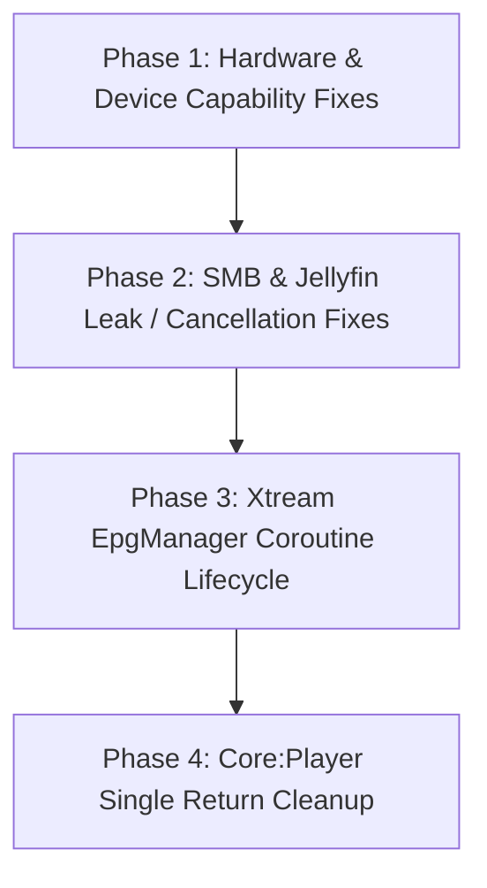

# Comprehensive Adversarial Codebase Review & Remediation Plan (Round 2)

**Status:** Proposed  
**Author:** AI Agent (Adversarial Audit)  
**Date:** 2026-09-12  

---

## 1. Executive Summary

Following earlier remediation sweeps, an adversarial deep dive was conducted across `core:player`, `core:network`, `core:ui`, `core:data`, `core:navigation`, `tv`, and `mobile`.

The review identified concrete edge cases, resource leaks, logic bugs, unhandled cancellations, and remaining architectural and style constraint violations across 4 categories:
1. **Hardware Detection & Capabilities:** False-negative 4K detection on Sony Bravia & other Android TVs lacking AV1 hardware decoding.
2. **Resource & Connection Lifecycle Leaks:** Unclosed `File` handles in SMB streaming and uncaught `CancellationException` in Jellyfin API client methods.
3. **Async / Coroutine Lifecycle & State Machine:** Stray unmanaged `CoroutineScope(Dispatchers.IO)` launching fire-and-forget loops without structured concurrency lifecycle bounding.
4. **Style Violations & Multi-Return Refactoring:** Remaining multi-return methods in `core:player` and `core:network`.

---

## 2. Review Findings & Root Cause Analysis

### 2.1 Hardware Capabilities & Media Playback

#### Finding H1: Sony Bravia 4K Capability False Negative Due to AV1 Requirement
* **Location:** [`DeviceCapabilities.kt:37-43`](file:///home/tahiry/data/code/mpilasy/fijerena/core/player/src/main/java/org/njarasoa/fijerena/core/player/device/DeviceCapabilities.kt#L37-L43)
* **Severity:** High
* **Mechanism:**
  ```kotlin
  val supportsHevc = supportsCodec("video/hevc")
  val supportsAv1 = supportsCodec("video/av01")
  val supports4K = supportsCodec("video/hevc") && supportsCodec("video/av01")
  ```
  `supports4K` strictly requires **both** HEVC and AV1. However, Sony Bravia TVs (e.g. MediaTek chipsets) and many 4K TV sticks natively support 4K HEVC (`video/hevc`) but do not have hardware AV1 decoders (`video/av01`).
  Consequently:
  - `supports4K` evaluates to `false` on Sony Bravia.
  - `maxResolution` falls back to `1920 to 1080` instead of `3840 to 2160`.
  - 4K streams on Sony Bravia are either capped or misreported.
* **Remediation:**
  - Decouple 4K resolution capability from AV1 codec support. A device supporting `video/hevc` (or `video/av01`) with 4K profile support should report 4K resolution capability.

---

### 2.2 Resource Leaks & Exception Handling

#### Finding L1: Unclosed SMB `File` Handle in `SmbClient.openInputStream`
* **Location:** [`SmbClient.kt:86-98`](file:///home/tahiry/data/code/mpilasy/fijerena/core/network/src/main/java/org/njarasoa/fijerena/core/network/smb/SmbClient.kt#L86-L98)
* **Severity:** High
* **Mechanism:**
  `openInputStream` opens an SMB `File` via `diskShare.openFile(...)` and returns `file.inputStream`. In the `smbj` library, closing `file.inputStream` does **not** close the underlying SMB `File` handle on the server. Over time, repeated file reads leak SMB server handles and connection slots until the server drops the connection.
* **Remediation:**
  - Wrap `file.inputStream` in a custom `FilterInputStream` whose `close()` method invokes `file.close()`.

#### Finding L2: Swallowed `CancellationException` in `JellyfinApiService`
* **Location:** [`JellyfinApiService.kt:318-353`](file:///home/tahiry/data/code/mpilasy/fijerena/core/network/src/main/java/org/njarasoa/fijerena/core/network/jellyfin/JellyfinApiService.kt#L318-L353)
* **Severity:** Medium
* **Mechanism:**
  `getItemById`, `searchItems`, and other methods catch generic `Exception` and wrap it into `Result.failure(e)` without rethrowing `CancellationException`. If the parent coroutine scope is cancelled during navigation, the request cancellation is treated as a network error, preventing clean coroutine teardown.
* **Remediation:**
  - Standardize error handling in `JellyfinApiService` using `suspendResultOf` or explicit `if (e is CancellationException) throw e`.

---

### 2.3 Unstructured Concurrency & Coroutine Lifecycle

#### Finding C1: Unmanaged `CoroutineScope(Dispatchers.IO)` in `XtreamEpgManager.getEpgForStream`
* **Location:** [`XtreamEpgManager.kt:123-130`](file:///home/tahiry/data/code/mpilasy/fijerena/core/network/src/main/java/org/njarasoa/fijerena/core/network/xtream/manager/XtreamEpgManager.kt#L123-L130)
* **Severity:** Medium
* **Mechanism:**
  `getEpgForStream` launches background refresh using a free-floating `CoroutineScope(Dispatchers.IO).launch`. This scope has no `SupervisorJob()` and is not bound to `writeScope` or `EpgFileManager`'s lifecycle. Repeated calls can spawn unbounded background jobs during rapid scrolling.
* **Remediation:**
  - Dispatch the background refresh onto `writeScope` or a dedicated lifecycle-managed background worker scope.

---

### 2.4 Code Style & Single Return Statement Enforcement

#### Finding S1: Multiple Returns in `core:player` Utility Functions
* **Locations:**
  - [`PlaybackFormat.kt:42-59`](file:///home/tahiry/data/code/mpilasy/fijerena/core/player/src/main/java/org/njarasoa/fijerena/core/player/model/PlaybackFormat.kt#L42-L59) (`parseDurationToSeconds`)
  - [`SeriesDetail.kt:85-97`](file:///home/tahiry/data/code/mpilasy/fijerena/core/player/src/main/java/org/njarasoa/fijerena/core/player/domain/SeriesDetail.kt#L85-L97) (`firstSeasonWithUnwatchedEpisode`)
  - [`SeriesDetail.kt:107-119`](file:///home/tahiry/data/code/mpilasy/fijerena/core/player/src/main/java/org/njarasoa/fijerena/core/player/domain/SeriesDetail.kt#L107-L119) (`resumeAnchorEpisodeId`)
  - [`StreamingPlaybackService.kt:712-788`](file:///home/tahiry/data/code/mpilasy/fijerena/core/player/src/main/java/org/njarasoa/fijerena/core/player/service/StreamingPlaybackService.kt#L712-L788) (`getAudioTracks`, `getSubtitleTracks`, `selectSubtitleTrack`)
* **Severity:** Low / Style Constraint
* **Remediation:**
  - Refactor all functions to use a single return statement per function, assigning or computing the result into an immutable or mutable accumulator variable.

---

## 3. Phased Remediation Roadmap



### Phase 1: Device Detection & 4K Capability (P0)
- In [`DeviceCapabilities.kt`](file:///home/tahiry/data/code/mpilasy/fijerena/core/player/src/main/java/org/njarasoa/fijerena/core/player/device/DeviceCapabilities.kt), compute `supports4K = supportsHevc || supportsAv1`.
- Verify resolution assignment on Sony Bravia and Shield profiles.

### Phase 2: SMB Resource Management & Jellyfin Cancellation (P1)
- In [`SmbClient.kt`](file:///home/tahiry/data/code/mpilasy/fijerena/core/network/src/main/java/org/njarasoa/fijerena/core/network/smb/SmbClient.kt), close `com.hierynomus.smbj.share.File` when the returned `InputStream` is closed.
- In [`JellyfinApiService.kt`](file:///home/tahiry/data/code/mpilasy/fijerena/core/network/src/main/java/org/njarasoa/fijerena/core/network/jellyfin/JellyfinApiService.kt), ensure `CancellationException` is rethrown in all `catch (e: Exception)` blocks.

### Phase 3: EPG Manager Coroutine Scoping (P2)
- In [`XtreamEpgManager.kt`](file:///home/tahiry/data/code/mpilasy/fijerena/core/network/src/main/java/org/njarasoa/fijerena/core/network/xtream/manager/XtreamEpgManager.kt), replace `CoroutineScope(Dispatchers.IO).launch` with `writeScope.launch`.

### Phase 4: Single Return Refactoring in `core:player` (P3)
- Refactor `parseDurationToSeconds`, `firstSeasonWithUnwatchedEpisode`, `resumeAnchorEpisodeId`, `getAudioTracks`, and `getSubtitleTracks` to adhere strictly to single return statements.

---

## 4. Verification Plan

1. **Automated Unit Tests:**
   - Run `./gradlew testDebugUnitTest` across all modules.
   - Add unit test for `DeviceDetector.detect()` mocking Sony Bravia and HEVC-only capability.
   - Add unit test for `parseDurationToSeconds` covering all formats.
2. **Code Style:**
   - Run `./gradlew ktlintCheck`.
3. **Build Integrity:**
   - Run `./gradlew assembleDebug` to guarantee zero compilation regressions.
