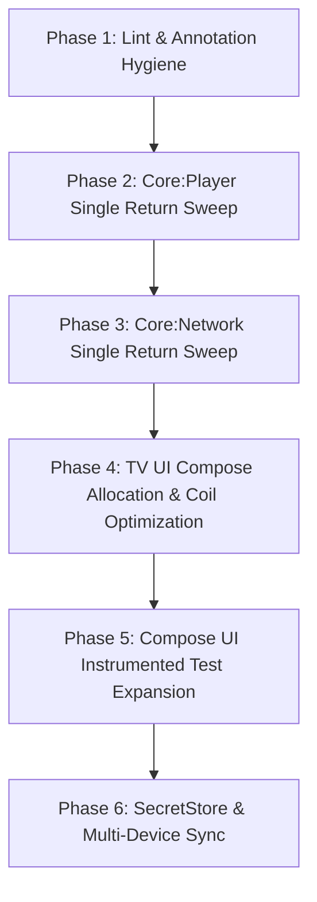

# Codebase Robustness & Technical Debt Plan

**Status:** Proposed  
**Date:** 2026-09-14  
**Scope:** Full codebase review (`core:player`, `core:network`, `core:ui`, `core:data`, `core:navigation`, `tv`, `mobile`)

---

## 1. Executive Summary & Verification Baseline

An empirical evaluation of the Fijerena codebase was conducted on 2026-09-14 to establish an objective robustness baseline following multiple audit and remediation cycles:

- **Build Integrity:** `./gradlew assembleDebug` compiles cleanly in ~12 seconds with AGP 9.4.0 and Gradle 9.6.0.
- **Style & Formatting:** `./gradlew ktlintCheck` passes cleanly across all 7 modules with zero violations.
- **Unit Test Suite:** 193 unit tests pass across all modules (`0 failures, 0 skipped, 0 errors`).
- **Remediation Milestones:** 
  - 29/29 issues resolved from [`20260824_codebase-audit-fix-plan.md`](file:///home/tahiry/data/code/mpilasy/fijerena/docs/plans/20260824_codebase-audit-fix-plan.md).
  - All verified findings from [`20260912_adversarial-codebase-remediation-plan.md`](file:///home/tahiry/data/code/mpilasy/fijerena/docs/plans/20260912_adversarial-codebase-remediation-plan.md) and [`20260912_adversarial-codebase-review-round2-plan.md`](file:///home/tahiry/data/code/mpilasy/fijerena/docs/plans/20260912_adversarial-codebase-review-round2-plan.md) applied.

### Core Robustness Pillars

| Pillar | State | Mechanism |
|--------|-------|-----------|
| **Data Durability** | Production-Grade | Room tables `watch_state` (v15/v17) and `favorite_state` (v16) in `xtream_v2.db` eliminate legacy SharedPreferences JSON blob truncation. Sticky completion (`MAX(existing, new)`) protects watched state. Two-level TMDB deduplication links variants by series-level TMDB ID and `(season, episodeNum)`. |
| **Concurrency & Thread Safety** | Hardened | Swallowed `CancellationException` hazards removed from `Result.kt`, `EpgFileManager.kt`, and `JellyfinApiService.kt`. Explicit `Closeable` on `MediaRepository` shuts down `HandlerThread` and cancels `writeScope`. SMB file handle leaks closed via `SmbFileInputStream`. |
| **Playback & Hardware** | High | Sony Bravia and HEVC-only TV chipsets correctly detect 4K via `supportsHevc || supportsAv1`. Hot-swapped `AdaptiveLoadControl` replays onto ExoPlayer playback thread. Session finalization awaited on back navigation. |
| **EPG Pipeline** | High | Conditional HTTP requests (`ETag`, `Last-Modified`) + SHA-256 payload checksums skip unchanged sources within 24h. Atomic FTS4 staging table swaps and Room recreation prevent table locks. |

---

## 2. Technical Debt & Fragility Areas

Despite high resilience in core layers, five areas of technical debt and fragility remain:

1. **Android TV UI Recomposition & GC Pressure:**
   - Navigating to large Live TV categories induces background GC pauses and main-thread layout spikes on memory-constrained hardware (NVIDIA Shield). Magnitude not yet profiled — needs a Perfetto/systrace capture before scoping a fix.
   - Rapid channel logo loading triggers `DiskLruCache` worker thread lock contention in Coil.
   - Screen re-entry from player on mobile exhibits an unexplained recomposition frame drop. Needs profiling to quantify.
2. **Lint & API Opt-In Warnings:**
   - Unannotated Media3 `@UnstableApi` usages in `FijerenaApplication.kt` block strict `./gradlew lintDebug`.
3. **Single Return Statement Compliance:**
   - Completed and verified across `core:ui`, `tv`, and `mobile`.
   - Remaining multi-return functions pending in `core:player` (~33 functions) and `core:network` (~145 functions).
4. **Test Coverage Asymmetry:**
   - High automated test coverage for domain logic, database operations, and parsers (193 tests).
   - Minimal automated Compose UI and navigation test coverage (currently limited to `EpisodeSelectionScreenTest` in `:tv`).
5. **Upstream Security Deprecation & Multi-Device Sync:**
   - `androidx.security:security-crypto` is deprecated upstream; owned Keystore replacement documented in [`20260828_secret-store-migration-plan.md`](file:///home/tahiry/data/code/mpilasy/fijerena/docs/plans/20260828_secret-store-migration-plan.md) is deferred.
   - Xtream user state remains device-local; multi-device synchronization is planned in [`20260809_xtream-multi-device-sync-plan.md`](file:///home/tahiry/data/code/mpilasy/fijerena/docs/plans/20260809_xtream-multi-device-sync-plan.md) but not started.

---

## 3. Phased Remediation Roadmap

### Phase 1: Lint & Annotation Hygiene (P0 - Immediate)
- **Goal:** Ensure `./gradlew lintDebug` passes with zero errors.
- **Tasks:**
  1. In [`FijerenaApplication.kt`](file:///home/tahiry/data/code/mpilasy/fijerena/core/ui/src/main/java/org/njarasoa/fijerena/core/ui/FijerenaApplication.kt), add `@OptIn(androidx.media3.common.util.UnstableApi::class)` where `StreamingPlaybackService` playback state is checked.
  2. Verify `./gradlew lintDebug` passes across all modules.

### Phase 2: Single Return Statement Sweep in `core:player` (P1)
- **Goal:** Enforce the project's single return statement rule across all methods in `core:player`.
- **Tasks:**
  1. Audit ~33 candidate functions identified by heuristic scan.
  2. Refactor each function to use a single exit point with immutable/accumulator return assignments.
  3. Verify with `./gradlew :core:player:testDebugUnitTest` and `./gradlew assembleDebug`.

### Phase 3: Single Return Statement Sweep in `core:network` (P2)
- **Goal:** Complete the single return refactoring across `core:network`.
- **Tasks:**
  1. Audit candidate functions in DAOs, API clients, and repositories.
  2. Refactor while preserving coroutine cancellation propagation (`if (e is CancellationException) throw e`).
  3. Verify with `./gradlew :core:network:testDebugUnitTest`.

### Phase 4: Android TV UI Compose Allocations & Image Contention (P2)
- **Goal:** Mitigate GC spikes during category browsing on Android TV.
- **Tasks:**
  1. Hoist allocations out of composables in `tv/.../feature/category/` and `tv/.../feature/livetv/`.
  2. Profile Coil channel logo loading under `Dispatchers.IO` to reduce `DiskLruCache` worker lock contention.
  3. Validate against measured baselines on hardware (NVIDIA Shield / Sony Bravia).

### Phase 5: Compose UI Instrumented Testing Expansion (P3)
- **Goal:** Protect fragile UI lifecycle and focus handoffs from regression.
- **Tasks:**
  1. Expand `tv/src/androidTest` to cover Live TV category selection, focus recovery on back-navigation, and modal dismissals.
  2. Mirror critical Compose tests in `mobile/src/androidTest`.
  3. Ensure all tests run cleanly on connected emulator / device.

### Phase 6: Long-Term Architecture (Deferred)
- **SecretStore Migration:** Replace deprecated `EncryptedSharedPreferences` per [`20260828_secret-store-migration-plan.md`](file:///home/tahiry/data/code/mpilasy/fijerena/docs/plans/20260828_secret-store-migration-plan.md).
- **Xtream Multi-Device Sync:** Implement shared state backend per [`20260809_xtream-multi-device-sync-plan.md`](file:///home/tahiry/data/code/mpilasy/fijerena/docs/plans/20260809_xtream-multi-device-sync-plan.md).

---

## 4. Verification & Quality Gates

Every phase must satisfy:
1. `./gradlew ktlintCheck` — zero style regressions.
2. `./gradlew testDebugUnitTest` — 193+ unit tests pass.
3. `./gradlew assembleDebug` — successful compilation for both mobile and TV targets.
4. On-device / emulator verification for UI and lifecycle modifications.
