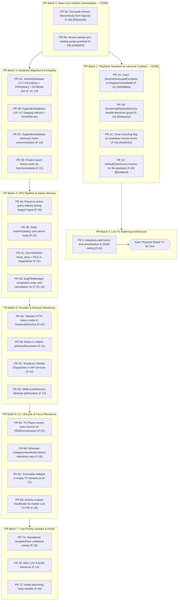

# Codebase Stability & Resilience Plan: Modular Remediation

**Status:** In Progress — Batches 0 & 1 complete (2026-09-22)  
**Date:** 2026-09-22  
**Scope:** `core:player`, `core:network`, `core:ui`, `core:navigation`, `tv`, `mobile`

---

## 1. Guiding Principles & Safety Protocols

1. **Surgical, Atomic PRs:**
   - Never bundle 28 fixes across 6 modules into monolithic phases.
   - Every finding or tight cluster must ship as an independent, isolated pull request that can be verified and reverted alone.
2. **Verify-Before-Trust:**
   - Before authoring any fix, inspect the exact lines on HEAD, verify the failure mode against runtime traces or tests, and validate the actual severity (downgrading if inflated).
3. **Hardware & Device Safety Protocol:**
   - Emulators first for automated verification.
   - **Strict hardware rule:** NEVER deploy or run automated tests against physical hardware (Shields, Sony Bravia, Chromecast) without explicit user confirmation.
   - Prior to any physical device interaction, always back up `shared_prefs/*` and `providers.db*` via `run-as tar` (see `docs/RUN_GUIDE.md`).
4. **Schema Documentation Rule:**
   - Database migrations must not be co-mingled. Every Room migration (`XtreamDatabase` v18, `EpgIndexDatabase` v17) lands in its own isolated commit and updates `docs/DATABASE_SCHEMA.md` in that exact same commit.
5. **Decouple Speculative Refactors from Defect Fixes:**
   - Refactor sweeps (e.g. codebase-wide `navigateOnce` replacements) are decoupled from verified bug fixes and deferred to standalone low-priority PRs.

---

## 2. Findings Catalog & Calibrated Severities

### Category 1: Active Data Loss Hazards (P0 - Immediate Hotfixes)
- **F-08 (`core:network`): `XtreamMediaProvider.disconnect()` conflates disconnect with full `logout()`** — ✅ **DONE** (commit `92be6c8e`)
  - *Location:* [`XtreamMediaProvider.kt:81-84`](file:///home/tahiry/data/code/mpilasy/fijerena/core/network/src/main/java/org/njarasoa/fijerena/core/network/XtreamMediaProvider.kt#L81-L84)
  - *Mechanism:* `disconnect()` calls `repository.logout()`, which clears credentials from `EncryptedSharedPreferences` and wipes Room catalog tables via `onClearCache()`. Called on provider switches and settings updates.
  - *Fix:* Replace `logout()` with a dedicated `disconnect()` that only tears down `apiService`.
  - *Landed:* `XtreamSessionManager.disconnect()` added (drops `apiService` under `sessionMutex`, leaves credentials/cache untouched), threaded through `XtreamRepository.disconnect()` into `XtreamMediaProvider.disconnect()`. Verified no other caller (`ProviderRepository.deleteProvider()`) relied on the old wipe-on-disconnect behavior — it already clears creds/cache directly.
- **F-09 (`core:network`): Catastrophic catalog purge on partial or glitched sync** — ✅ **DONE** (commit `c5696d7f`)
  - *Location:* [`XtreamContentManager.kt:662-682, 784-802`](file:///home/tahiry/data/code/mpilasy/fijerena/core/network/src/main/java/org/njarasoa/fijerena/core/network/xtream/manager/XtreamContentManager.kt#L662-L682)
  - *Mechanism:* `seenIds.isEmpty()` guard allows partial syncs (e.g. 5 items returned due to server glitch) to delete all remaining 10,000+ local catalog items from SQLite.
  - *Fix:* Add threshold guard: abort deletions if returned count is <20% of existing local count (>50 items).
  - *Landed:* `isSuspiciousPartialSync()` guard added, applied to `syncStreams` and `syncSeries` as scoped — plus `syncCategories`, which the original audit missed but had the identical gap.

---

### Category 2: Process Crashes, Hangs & Playback Deadlocks (P1)
- **F-01 (`core:player`): Uncaught `ServiceDestroyedException` crashes app in `PlaybackViewModel`** — ✅ **DONE** (commit `80d3d66a`)
  - *Location:* [`PlaybackViewModel.kt:207-243, 278-307, 347-415`](file:///home/tahiry/data/code/mpilasy/fijerena/core/player/src/main/java/org/njarasoa/fijerena/core/player/viewmodel/PlaybackViewModel.kt#L207-L243)
  - *Mechanism:* `pause()`, `resume()`, `stop()`, `seekTo()`, and track selection call `awaitInstance()` inside unhandled `viewModelScope.launch` blocks. Throws unchecked `ServiceDestroyedException` directly to `Thread.UncaughtExceptionHandler`.
  - *Fix:* Use null-safe `StreamingPlaybackService.getInstance()?.let { ... }` for control actions; catch `ServiceDestroyedException` in state observers.
  - *Landed:* Chose a `try/catch`-based `launchServiceAction()` helper over `getInstance()?.let{}` — preserves the original wait-for-startup semantics (a control action fired while the service is still coming up now succeeds once it's ready, instead of silently no-op'ing). Swallows `TimeoutCancellationException`/`ServiceDestroyedException`, lets real `CancellationException` propagate. Also caught the same bare `awaitInstance()` in `observeServiceState()` (line 131, outside the audit's cited ranges) — same crash class, fired automatically on every ViewModel init/restart, arguably the most likely trigger of the two.
- **F-02 (`core:player`): High-bitrate Live TV buffer cap deadlock**
  - *Location:* [`AdaptiveLoadControl.kt:144`](file:///home/tahiry/data/code/mpilasy/fijerena/core/player/src/main/java/org/njarasoa/fijerena/core/player/loadcontrol/AdaptiveLoadControl.kt#L144), [`NetworkBufferProfile.kt:65`](file:///home/tahiry/data/code/mpilasy/fijerena/core/player/src/main/java/org/njarasoa/fijerena/core/player/loadcontrol/NetworkBufferProfile.kt#L65), [`StreamHealthMonitor.kt:42`](file:///home/tahiry/data/code/mpilasy/fijerena/core/player/src/main/java/org/njarasoa/fijerena/core/player/service/StreamHealthMonitor.kt#L42)
  - *Mechanism:* 16MB buffer cap with `prioritizeTimeOverSizeThresholds = false` yields only ~6.4s on high-bitrate streams (>16Mbps). `StreamHealthMonitor` demands `minBufferMs = 8000L` (8s). `isBufferLow` is continuously true; stream cycles through recycles and terminates after 3 minutes (`Recovery exhausted`).
  - *Fix:* Set `.setPrioritizeTimeOverSizeThresholds(true)` and increase buffer ceiling to 32MB. **Merge gated on Shield TV 4K physical verification.**
- **F-03 (`core:player`): Double-teardown publication race in `StreamingPlaybackService`** — ✅ **DONE** (commit `d5ebaa1e`)
  - *Location:* [`StreamingPlaybackService.kt:1001-1059`](file:///home/tahiry/data/code/mpilasy/fijerena/core/player/src/main/java/org/njarasoa/fijerena/core/player/service/StreamingPlaybackService.kt#L1001-L1059)
  - *Mechanism:* `stopAndRelease()` calls `releasePlayerAndSession()`, followed by `stopSelf()`. When `onDestroy()` dispatches, it runs `releasePlayerAndSession()` again without an `isReleased` check, exceptionally completing the *new* `instanceReady` deferred of a newly starting stream.
  - *Fix:* Guard with `isReleased` flag and check `instance === this` under `instanceLock`.
  - *Landed:* Both guards added as scoped. Also updated the function's pre-existing kdoc, which claimed the double-call was already safe because `mediaSession` goes null the second time — true for the `?.run` blocks, but it never accounted for the `instance`/`instanceReady` mutation reachable regardless, which is exactly this bug.
- **F-04 (`core:player`): Dead state hang on failed seamless recycle** — ✅ **DONE** (commit `94ebf181`)
  - *Location:* [`StreamingPlaybackService.kt:623-626, 688`](file:///home/tahiry/data/code/mpilasy/fijerena/core/player/src/main/java/org/njarasoa/fijerena/core/player/service/StreamingPlaybackService.kt#L623-L626)
  - *Mechanism:* If an error occurs while recycling, `isRecycling()` remains true, aborting retries and suppressing error display.
  - *Fix:* Unconditionally call `setRecycling(false)` on error in `handleStreamEndedOrError()`.
  - *Landed:* Root cause was more specific than the cited fix point — `performSeamlessRecycle()` sets `isRecycling(true)` before building the new media source, then returns without resetting it if `createMediaSource()` comes back null. Fixed at that exact early-return instead of in `handleStreamEndedOrError()`.
- **F-05 (`core:player`): `OkHttpDataSource` set as root breaks local & SMB playback** — ✅ **DONE** (commit `86cd8ee4`)
  - *Location:* [`StreamingMediaSourceFactory.kt:50-55`](file:///home/tahiry/data/code/mpilasy/fijerena/core/player/src/main/java/org/njarasoa/fijerena/core/player/source/StreamingMediaSourceFactory.kt#L50-L55)
  - *Mechanism:* Overriding root data source factory with raw `OkHttpDataSource.Factory` causes `IllegalArgumentException: Expected HTTP scheme` for `file://` or `smb://`.
  - *Fix:* Wrap in `androidx.media3.datasource.DefaultDataSource.Factory(context, httpDataSourceFactory)`.
  - *Landed:* Fixes `file://`/`content://` as scoped. The `smb://` half of the claim doesn't hold: no `DataSource` for that scheme is registered anywhere in the player module, so SMB playback needs its own follow-up (a custom `SmbDataSource`), not just this wrapper — flagged, not built, since it's outside this fix's scope.

---

### Category 3: Database Stability & Missing Indices (P1/P2)
- **F-15 (`core:ui`): Watch history write cancelled on screen exit**
  - *Location:* [`StreamLoaderViewModel.kt:583-592`](file:///home/tahiry/data/code/mpilasy/fijerena/core/ui/src/main/java/org/njarasoa/fijerena/core/ui/viewmodels/StreamLoaderViewModel.kt#L583-L592)
  - *Mechanism:* `doStopPlayback()` runs in `viewModelScope`, cancelled when the screen is popped on Back press before Room write finishes.
  - *Fix:* Wrap execution in `withContext(NonCancellable + Dispatchers.IO)`.
- **F-16 (`core:network`): Unbounded WAL growth in `XtreamDatabase`**
  - *Location:* [`XtreamDatabase.kt:193-212`](file:///home/tahiry/data/code/mpilasy/fijerena/core/network/src/main/java/org/njarasoa/fijerena/core/network/xtream/db/XtreamDatabase.kt#L193-L212)
  - *Mechanism:* Lacks `PRAGMA synchronous = NORMAL` and `journal_size_limit`.
  - *Fix:* Add `RoomDatabase.Callback` setting `synchronous = NORMAL` and `journal_size_limit = 10485760`.
- **F-17 & F-18 (`core:network`): Missing indices on `xtream_series` and `xtream_episodes`**
  - *Location:* `XtreamSeriesEntity.kt`, `XtreamEpisodeEntity.kt`
  - *Mechanism:* Missing composite indices on `(providerId, tmdbId)` and `(providerId, season, episodeNum)` cause full table scans during watch state deduplication.
  - *Fix:* Room Migration `17→18` in `XtreamDatabase` + `DATABASE_SCHEMA.md` update.
- **F-19 (`core:network`): Concurrency race in `EpgIndexDatabase.destroy()` vs `getInstance()`**
  - *Location:* [`EpgIndexDatabase.kt:118-128`](file:///home/tahiry/data/code/mpilasy/fijerena/core/network/src/main/java/org/njarasoa/fijerena/core/network/xmltv/epgindex/EpgIndexDatabase.kt#L118-L128)
  - *Mechanism:* `destroy()` exits synchronized block before deleting SQLite files, allowing a racing `getInstance()` to create a database that `destroy()` deletes.
  - *Fix:* Synchronize file deletion under the database instance creation lock.

---

### Category 4: EPG Ingestion, Memory Pressure & Query Contention (P1/P2)
- **F-20 (`core:network`): Dropping query indices on active guide during staged ingestion**
  - *Location:* [`EpgIndexer.kt:542-543`](file:///home/tahiry/data/code/mpilasy/fijerena/core/network/src/main/java/org/njarasoa/fijerena/core/network/xmltv/epgindex/EpgIndexer.kt#L542-L543)
  - *Mechanism:* Query indices on `epg_programme` are dropped at start of ingest even when writes target `epg_programme_staging`. Live TV guide queries perform full table scans across 2M+ rows.
  - *Fix:* Only drop indices if `!useStaging`.
- **F-21 (`core:network`): SQLite `PRAGMA temp_store = MEMORY` triggers Android TV LMK kill**
  - *Location:* [`EpgIndexer.kt:424, 545`](file:///home/tahiry/data/code/mpilasy/fijerena/core/network/src/main/java/org/njarasoa/fijerena/core/network/xmltv/epgindex/EpgIndexer.kt#L424)
  - *Mechanism:* In-memory B-tree merge tables during FTS rebuild on large XMLs push native RSS over 150MB, causing OS to kill process.
  - *Fix:* Change to `PRAGMA temp_store = FILE`.
- **F-22 (`core:network`): Premature FTS lock blocks search during download**
  - *Location:* [`EpgIndexer.kt:536`](file:///home/tahiry/data/code/mpilasy/fijerena/core/network/src/main/java/org/njarasoa/fijerena/core/network/xmltv/epgindex/EpgIndexer.kt#L536), [`XmltvSearchService.kt:161`](file:///home/tahiry/data/code/mpilasy/fijerena/core/network/src/main/java/org/njarasoa/fijerena/core/network/xmltv/XmltvSearchService.kt#L161)
  - *Mechanism:* `markFtsStale()` called at download start rather than swap start, throwing `EpgIndexBusyException` for 15+ minutes.
  - *Fix:* Defer `markFtsStale()` until `executeSwapToMain()` runs.
- **F-23 & F-24 (`core:network`): EPG state machine completion and cancellation races**
  - *Location:* [`EpgFileManager.kt:800, 824`](file:///home/tahiry/data/code/mpilasy/fijerena/core/network/src/main/java/org/njarasoa/fijerena/core/network/xmltv/EpgFileManager.kt#L800)
  - *Mechanism:* `Completed` emitted before FTS index finishes; `CancellationException` rethrown without resetting `Processing` state.
  - *Fix:* Emit `Completed` after post-processing completes; reset to `Idle` on cancellation.

---

### Category 5: Network Protocols & Client Lifecycle (P2)
- **F-10 (`core:player`): Unchecked HTTP status codes mask errors as JSON parser crashes**
  - *Location:* [`XtreamApiService.kt:102-125`](file:///home/tahiry/data/code/mpilasy/fijerena/core/player/src/main/java/org/njarasoa/fijerena/core/player/api/XtreamApiService.kt#L102-L125)
  - *Mechanism:* HTML error responses (401, 403, 429, 502) are passed directly to `decodeFromString`, throwing `SerializationException: Unexpected token '<'`.
  - *Fix:* Validate `response.status` and throw typed `HttpException`.
- **F-11 (`core:network`): Missing Mutex in `JellyfinMediaProvider.withAutoReconnect`**
  - *Location:* [`JellyfinMediaProvider.kt:558-574`](file:///home/tahiry/data/code/mpilasy/fijerena/core/network/src/main/java/org/njarasoa/fijerena/core/network/jellyfin/JellyfinMediaProvider.kt#L558-L574)
  - *Mechanism:* Concurrent 401s launch parallel re-auths; null `userId` produces `/Users/null/Items` requests.
  - *Fix:* Add `Mutex` around re-authentication; prevent wiping credentials for Quick Connect.
- **F-12 (`core:network`): OkHttp dispatcher and connection pool leak on API service close**
  - *Location:* [`XtreamApiService.kt:86`](file:///home/tahiry/data/code/mpilasy/fijerena/core/player/src/main/java/org/njarasoa/fijerena/core/player/api/XtreamApiService.kt#L86), [`JellyfinApiService.kt:56`](file:///home/tahiry/data/code/mpilasy/fijerena/core/network/src/main/java/org/njarasoa/fijerena/core/network/jellyfin/JellyfinApiService.kt#L56)
  - *Mechanism:* Custom OkHttp `Dispatcher` and `ConnectionPool` are not closed when Ktor engine uses `preconfigured`.
  - *Fix:* Explicitly shut down dispatcher executor and evict connection pool in `close()`.
- **F-13 (`core:network`): SMB directory scan executes 1,000 blocking RPCs**
  - *Location:* [`SmbMediaProvider.kt:124-194`](file:///home/tahiry/data/code/mpilasy/fijerena/core/network/src/main/java/org/njarasoa/fijerena/core/network/smb/SmbMediaProvider.kt#L124-L194)
  - *Mechanism:* Calls `isDirectory(path)` for every entry, issuing individual network RPCs over SMB.
  - *Fix:* Read directory flag from `entry.fileAttributes` directly in directory listing.

---

### Category 6: UI, Lifecycle & Navigation Resilience (P2/P3)
- **F-25 (`tv`): Black screen on return from TV screensaver / HDMI switch**
  - *Location:* [`TvPlayerScreen.kt:105-110`](file:///home/tahiry/data/code/mpilasy/fijerena/tv/src/main/java/org/njarasoa/fijerena/feature/player/TvPlayerScreen.kt#L105-L110)
  - *Mechanism:* `MainActivity.onStop()` releases player; `TvPlayerScreen` on `ON_RESUME` cancels focus timer but never restarts playback.
  - *Fix:* If `playbackState is Idle` and stream state was `Success`, re-trigger `playStream()` on resume.
- **F-26 (`core:ui`): `lateinit var repository` initialization race in `CategoryViewModel`**
  - *Location:* [`CategoryViewModel.kt:157`](file:///home/tahiry/data/code/mpilasy/fijerena/core/ui/src/main/java/org/njarasoa/fijerena/core/ui/viewmodels/CategoryViewModel.kt#L157)
  - *Mechanism:* Uninitialized repository silently drops `loadStreams()` and favorite actions.
  - *Fix:* Use async `awaitRepository()` suspend pattern and wrap calls in `runCatching`.
- **F-27 (`tv`): D-pad focus trap in empty `StreamList`**
  - *Location:* [`StreamList.kt:332-348`](file:///home/tahiry/data/code/mpilasy/fijerena/tv/src/main/java/org/njarasoa/fijerena/feature/category/components/StreamList.kt#L332-L348)
  - *Mechanism:* Zero focusable elements in empty state; removing last favorite drops focus to window root.
  - *Fix:* Add a focusable action button (e.g. "Refresh" or "Back to Categories") in empty state.
- **F-28 (`mobile`): Mobile Live TV Picture-in-Picture broken**
  - *Location:* [`MainActivity.kt:91`](file:///home/tahiry/data/code/mpilasy/fijerena/mobile/src/main/java/org/njarasoa/fijerena/MainActivity.kt#L91), [`MobileCategoryListScreen.kt:252`](file:///home/tahiry/data/code/mpilasy/fijerena/mobile/src/main/java/org/njarasoa/fijerena/feature/category/MobileCategoryListScreen.kt#L252)
  - *Mechanism:* Mini-player uses nav-scoped ViewModel; `MainActivity` queries Activity-scoped ViewModel.
  - *Fix:* Scope docked Live TV `PlaybackViewModel` to the Activity.

---

### Category 7: Decoupled Low-Priority Sweeps & Polish (P3)
- **F-29 (`core:navigation`): `navigateOnce` sweep across navigation hosts**
  - *Location:* `TvNavHost.kt`, `MobileNavHost.kt`
  - *Status:* Speculative refactor; isolate into standalone PR.
- **F-14 (`core:network`): UTF-8 BOM handling in M3U parser**
  - *Location:* `M3uParser.kt:39`
  - *Status:* Edge-case format tolerance.
- **F-06 (`core:player`): `setHandleAudioBecomingNoisy(true)`**
  - *Location:* `StreamingPlaybackService.kt:360`
  - *Status:* Mobile UX enhancement.

---

## 3. Modular Delivery Batches (Independent PR Units)

---

## 4. Execution Sequence & PR Gates

1. **Batch 0 (Immediate Hotfixes):** ✅ **DONE (2026-09-22)**
   - Shipped PR 0A (`F-08`, commit `92be6c8e`) and PR 0B (`F-09`, commit `c5696d7f`).
2. **Batch 1 (Playback Crashes):** ✅ **DONE (2026-09-22)**
   - Shipped PR 1A (`80d3d66a`), 1B (`d5ebaa1e`), 1C (`94ebf181`), 1D (`86cd8ee4`). Compiles + ktlint clean on `core:player`; not yet run on-device — see note below.
3. **Batch 2 (Buffer Architecture):**
   - Author PR 2. Do not merge until verified on physical NVIDIA Shield hardware streaming a 4K/60fps channel continuously for 15 minutes.
4. **Batch 3 (Room Migrations):**
   - Ship PR 3A and 3B in separate commits, each updating `docs/DATABASE_SCHEMA.md` in lockstep.
5. **Batch 4 (EPG Pipeline):**
   - Ship PR 4A through 4D to eliminate native RSS bloat and guide browsing freezes.
6. **Batch 5 & 6 (Network & UI):**
   - Ship provider concurrency and UI focus fixes as isolated PRs.
7. **Batch 7 (Sweeps):**
   - Execute broad refactor sweeps only after all functional defects are resolved.
