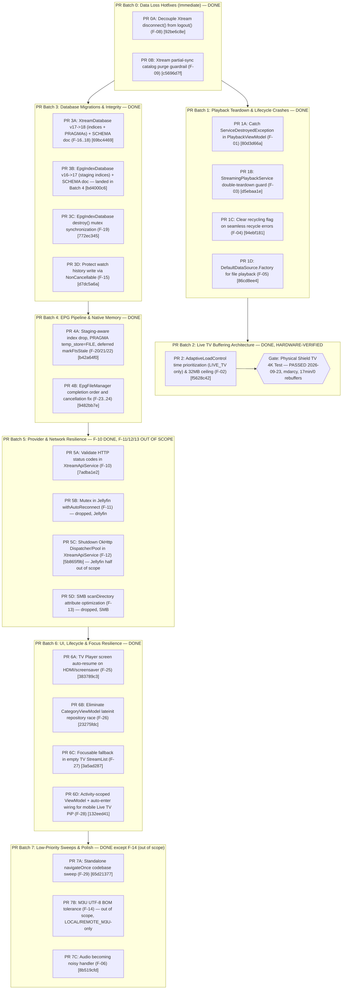

# Codebase Stability & Resilience Plan: Modular Remediation

**Status:** ✅ **COMPLETE** — every finding landed except explicitly out-of-scope ones, plus 4 additional defects from an independent code review (§5 Addendum). Batches 0-7 done, F-02 hardware-verified, F-06/F-29/F-12(Xtream half) done (2026-09-23). Verified on-device: XtreamDatabase migration passed on `emulator-5554`; F-02 confirmed on mdarcy Shield — 17 min continuous 4K live playback, 0 rebuffers, 0 dropped frames, `Stream Health: HEALTHY` throughout. Only F-11/F-13/F-14 and F-12's Jellyfin half remain, all intentionally out of scope (Jellyfin/SMB/M3U-only) — see their entries below.  
**Scope note (2026-09-22):** remaining work narrowed to general (provider-agnostic) and Xtream-specific findings only, per direction — F-11 (Jellyfin), F-13 (SMB), and F-14 (M3U/LOCAL parsing) are out of scope going forward. F-12 (OkHttp dispatcher leak) touches both Xtream and Jellyfin `ApiService`; if picked up, scope it to the Xtream half only.  
**Date:** 2026-09-22  
**Scope:** `core:player`, `core:network`, `core:ui`, `core:navigation`, `tv`, `mobile`

---

## 1. Guiding Principles & Safety Protocols

1. **Surgical, Atomic PRs:**
   - Never bundle 28 fixes across 6 modules into monolithic phases.
   - Every finding or tight cluster must ship as an independent, isolated pull request that can be verified and reverted alone.
2. **Verify-Before-Trust:**
   - Before authoring any fix, inspect the exact lines on HEAD, verify the failure mode against runtime traces or tests, and validate the actual severity (downgrading if inflated).
3. **Hardware & Device Safety Protocol:**
   - Emulators first for automated verification.
   - **Strict hardware rule:** NEVER deploy or run automated tests against physical hardware (Shields, Sony Bravia, Chromecast) without explicit user confirmation.
   - Prior to any physical device interaction, always back up `shared_prefs/*` and `providers.db*` via `run-as tar` (see `docs/RUN_GUIDE.md`).
4. **Schema Documentation Rule:**
   - Database migrations must not be co-mingled. Every Room migration (`XtreamDatabase` v18, `EpgIndexDatabase` v17) lands in its own isolated commit and updates `docs/DATABASE_SCHEMA.md` in that exact same commit.
5. **Decouple Speculative Refactors from Defect Fixes:**
   - Refactor sweeps (e.g. codebase-wide `navigateOnce` replacements) are decoupled from verified bug fixes and deferred to standalone low-priority PRs.

---

## 2. Findings Catalog & Calibrated Severities

### Category 1: Active Data Loss Hazards (P0 - Immediate Hotfixes)
- **F-08 (`core:network`): `XtreamMediaProvider.disconnect()` conflates disconnect with full `logout()`** — ✅ **DONE** (commit `92be6c8e`)
  - *Location:* [`XtreamMediaProvider.kt:81-84`](file:///home/tahiry/data/code/mpilasy/fijerena/core/network/src/main/java/org/njarasoa/fijerena/core/network/XtreamMediaProvider.kt#L81-L84)
  - *Mechanism:* `disconnect()` calls `repository.logout()`, which clears credentials from `EncryptedSharedPreferences` and wipes Room catalog tables via `onClearCache()`. Called on provider switches and settings updates.
  - *Fix:* Replace `logout()` with a dedicated `disconnect()` that only tears down `apiService`.
  - *Landed:* `XtreamSessionManager.disconnect()` added (drops `apiService` under `sessionMutex`, leaves credentials/cache untouched), threaded through `XtreamRepository.disconnect()` into `XtreamMediaProvider.disconnect()`. Verified no other caller (`ProviderRepository.deleteProvider()`) relied on the old wipe-on-disconnect behavior — it already clears creds/cache directly.
- **F-09 (`core:network`): Catastrophic catalog purge on partial or glitched sync** — ✅ **DONE** (commit `c5696d7f`)
  - *Location:* [`XtreamContentManager.kt:662-682, 784-802`](file:///home/tahiry/data/code/mpilasy/fijerena/core/network/src/main/java/org/njarasoa/fijerena/core/network/xtream/manager/XtreamContentManager.kt#L662-L682)
  - *Mechanism:* `seenIds.isEmpty()` guard allows partial syncs (e.g. 5 items returned due to server glitch) to delete all remaining 10,000+ local catalog items from SQLite.
  - *Fix:* Add threshold guard: abort deletions if returned count is <20% of existing local count (>50 items).
  - *Landed:* `isSuspiciousPartialSync()` guard added, applied to `syncStreams` and `syncSeries` as scoped — plus `syncCategories`, which the original audit missed but had the identical gap.

---

### Category 2: Process Crashes, Hangs & Playback Deadlocks (P1)
- **F-01 (`core:player`): Uncaught `ServiceDestroyedException` crashes app in `PlaybackViewModel`** — ✅ **DONE** (commit `80d3d66a`)
  - *Location:* [`PlaybackViewModel.kt:207-243, 278-307, 347-415`](file:///home/tahiry/data/code/mpilasy/fijerena/core/player/src/main/java/org/njarasoa/fijerena/core/player/viewmodel/PlaybackViewModel.kt#L207-L243)
  - *Mechanism:* `pause()`, `resume()`, `stop()`, `seekTo()`, and track selection call `awaitInstance()` inside unhandled `viewModelScope.launch` blocks. Throws unchecked `ServiceDestroyedException` directly to `Thread.UncaughtExceptionHandler`.
  - *Fix:* Use null-safe `StreamingPlaybackService.getInstance()?.let { ... }` for control actions; catch `ServiceDestroyedException` in state observers.
  - *Landed:* Chose a `try/catch`-based `launchServiceAction()` helper over `getInstance()?.let{}` — preserves the original wait-for-startup semantics (a control action fired while the service is still coming up now succeeds once it's ready, instead of silently no-op'ing). Swallows `TimeoutCancellationException`/`ServiceDestroyedException`, lets real `CancellationException` propagate. Also caught the same bare `awaitInstance()` in `observeServiceState()` (line 131, outside the audit's cited ranges) — same crash class, fired automatically on every ViewModel init/restart, arguably the most likely trigger of the two.
- **F-02 (`core:player`): High-bitrate Live TV buffer cap deadlock** — ✅ **DONE, HARDWARE-VERIFIED** (commit `f5628c42`)
  - *Location:* [`AdaptiveLoadControl.kt:144`](file:///home/tahiry/data/code/mpilasy/fijerena/core/player/src/main/java/org/njarasoa/fijerena/core/player/loadcontrol/AdaptiveLoadControl.kt#L144), [`NetworkBufferProfile.kt:65`](file:///home/tahiry/data/code/mpilasy/fijerena/core/player/src/main/java/org/njarasoa/fijerena/core/player/loadcontrol/NetworkBufferProfile.kt#L65), [`StreamHealthMonitor.kt:42`](file:///home/tahiry/data/code/mpilasy/fijerena/core/player/src/main/java/org/njarasoa/fijerena/core/player/service/StreamHealthMonitor.kt#L42)
  - *Mechanism:* 16MB buffer cap with `prioritizeTimeOverSizeThresholds = false` yields only ~6.4s on high-bitrate streams (>16Mbps). `StreamHealthMonitor` demands `minBufferMs = 8000L` (8s). `isBufferLow` is continuously true; stream cycles through recycles and terminates after 3 minutes (`Recovery exhausted`).
  - *Fix:* Set `.setPrioritizeTimeOverSizeThresholds(true)` and increase buffer ceiling to 32MB. **Merge gated on Shield TV 4K physical verification.**
  - *Landed:* The plan's fix as written would have flipped `prioritizeTimeOverSizeThresholds` globally — but `buildDelegate()` uses the *same* call for VOD, and `NetworkBufferProfile.VOD_TARGET_BUFFER_BYTES`'s existing kdoc documents that VOD deliberately prioritizes its size cap over time specifically to bound native memory on high-bitrate 4K VOD on 1-2GB Android TV devices. A global flip would have silently reopened that OOM risk to fix a LIVE-only bug. Scoped the flip to `contentType == LIVE_TV` only; VOD keeps `false` unchanged. Buffer cap raised to 32MB as planned.
  - *Hardware-verified (2026-09-23):* Deployed to mdarcy Shield, watched a real 4K/HEVC Sky Sports UHD live channel (~300+ Mbps burst network speed, well above the ~16Mbps trigger threshold) via the app's own Stats-for-Nerds overlay. **17:02 continuous playback, `Stream Health: HEALTHY` the entire time, 0 rebuffers, 0 dropped frames, 0.00% drop rate, buffered duration held above the 15-30s target throughout** — the old bug's failure signature (buffer stuck under 8s, hard error around the 3-minute mark) never appeared. Also deployed to the Bravia (`192.168.68.22:5555`), same build, not separately watched. Both Shields and the Bravia were backed up (`scripts/deploy-tv-ip.sh`'s default behavior) before each install.
- **F-03 (`core:player`): Double-teardown publication race in `StreamingPlaybackService`** — ✅ **DONE** (commit `d5ebaa1e`)
  - *Location:* [`StreamingPlaybackService.kt:1001-1059`](file:///home/tahiry/data/code/mpilasy/fijerena/core/player/src/main/java/org/njarasoa/fijerena/core/player/service/StreamingPlaybackService.kt#L1001-L1059)
  - *Mechanism:* `stopAndRelease()` calls `releasePlayerAndSession()`, followed by `stopSelf()`. When `onDestroy()` dispatches, it runs `releasePlayerAndSession()` again without an `isReleased` check, exceptionally completing the *new* `instanceReady` deferred of a newly starting stream.
  - *Fix:* Guard with `isReleased` flag and check `instance === this` under `instanceLock`.
  - *Landed:* Both guards added as scoped. Also updated the function's pre-existing kdoc, which claimed the double-call was already safe because `mediaSession` goes null the second time — true for the `?.run` blocks, but it never accounted for the `instance`/`instanceReady` mutation reachable regardless, which is exactly this bug.
- **F-04 (`core:player`): Dead state hang on failed seamless recycle** — ✅ **DONE** (commit `94ebf181`)
  - *Location:* [`StreamingPlaybackService.kt:623-626, 688`](file:///home/tahiry/data/code/mpilasy/fijerena/core/player/src/main/java/org/njarasoa/fijerena/core/player/service/StreamingPlaybackService.kt#L623-L626)
  - *Mechanism:* If an error occurs while recycling, `isRecycling()` remains true, aborting retries and suppressing error display.
  - *Fix:* Unconditionally call `setRecycling(false)` on error in `handleStreamEndedOrError()`.
  - *Landed:* Root cause was more specific than the cited fix point — `performSeamlessRecycle()` sets `isRecycling(true)` before building the new media source, then returns without resetting it if `createMediaSource()` comes back null. Fixed at that exact early-return instead of in `handleStreamEndedOrError()`.
- **F-05 (`core:player`): `OkHttpDataSource` set as root breaks local & SMB playback** — ✅ **DONE** (commit `86cd8ee4`)
  - *Location:* [`StreamingMediaSourceFactory.kt:50-55`](file:///home/tahiry/data/code/mpilasy/fijerena/core/player/src/main/java/org/njarasoa/fijerena/core/player/source/StreamingMediaSourceFactory.kt#L50-L55)
  - *Mechanism:* Overriding root data source factory with raw `OkHttpDataSource.Factory` causes `IllegalArgumentException: Expected HTTP scheme` for `file://` or `smb://`.
  - *Fix:* Wrap in `androidx.media3.datasource.DefaultDataSource.Factory(context, httpDataSourceFactory)`.
  - *Landed:* Fixes `file://`/`content://` as scoped. The `smb://` half of the claim doesn't hold: no `DataSource` for that scheme is registered anywhere in the player module, so SMB playback needs its own follow-up (a custom `SmbDataSource`), not just this wrapper — flagged, not built, since it's outside this fix's scope.

---

### Category 3: Database Stability & Missing Indices (P1/P2)
- **F-15 (`core:ui`): Watch history write cancelled on screen exit** — ✅ **DONE** (commit `d7dc5a6a`)
  - *Location:* [`StreamLoaderViewModel.kt:583-592`](file:///home/tahiry/data/code/mpilasy/fijerena/core/ui/src/main/java/org/njarasoa/fijerena/core/ui/viewmodels/StreamLoaderViewModel.kt#L583-L592)
  - *Mechanism:* `doStopPlayback()` runs in `viewModelScope`, cancelled when the screen is popped on Back press before Room write finishes.
  - *Fix:* Wrap execution in `withContext(NonCancellable + Dispatchers.IO)`.
  - *Landed:* Fixed as scoped, only at `stopPlayback()` (the fire-and-forget caller) — `stopPlaybackAwaited()` already used `withContext` from the caller's own scope, not `viewModelScope`, so it wasn't exposed to this cancellation in the first place.
- **F-16 (`core:network`): Unbounded WAL growth in `XtreamDatabase`** — ✅ **DONE** (commit `69bc4469`)
  - *Location:* [`XtreamDatabase.kt:193-212`](file:///home/tahiry/data/code/mpilasy/fijerena/core/network/src/main/java/org/njarasoa/fijerena/core/network/xtream/db/XtreamDatabase.kt#L193-L212)
  - *Mechanism:* Lacks `PRAGMA synchronous = NORMAL` and `journal_size_limit`.
  - *Fix:* Add `RoomDatabase.Callback` setting `synchronous = NORMAL` and `journal_size_limit = 10485760`.
  - *Landed:* Fixed as scoped. `journal_size_limit` routed through the same `execPragma()` cursor-stepping helper `EpgIndexDatabase` already uses, not plain `execSQL()` — that PRAGMA echoes its new value as a result row, which Android's `execSQL` rejects.
- **F-17 & F-18 (`core:network`): Missing indices on `xtream_series` and `xtream_episodes`** — ✅ **DONE** (commit `69bc4469`)
  - *Location:* `XtreamSeriesEntity.kt`, `XtreamEpisodeEntity.kt`
  - *Mechanism:* Missing composite indices on `(providerId, tmdbId)` and `(providerId, season, episodeNum)` cause full table scans during watch state deduplication.
  - *Fix:* Room Migration `17→18` in `XtreamDatabase` + `DATABASE_SCHEMA.md` update.
  - *Landed:* Both indices added, migration index names matched to Room's default `index_<table>_<col1>_<col2>` convention exactly (verified against the existing v10/v14/v15 migrations' naming for consistency). `docs/DATABASE_SCHEMA.md` updated in the same commit. Bundled with F-16 — same file, same migration, one PR as the plan intended.
  - *Verified (2026-09-22):* Added `core:network`'s first `androidTest` source set with a Room `MIGRATION_17_18` test — builds a byte-correct v18 database via Room, rolls it back to v17 shape (drops the two new indices, resets `PRAGMA user_version`), reopens through Room with only this migration registered and no destructive fallback, and asserts it succeeds with seeded rows intact. Ran on `emulator-5554` (Pixel_10 AVD) only — the two real Shields were disconnected from adb first and reconnected after, per the no-device-without-asking rule. **Passed**: `tests="1" failures="0" errors="0"`. `MIGRATION_17_18` made `internal` (was `private`) so the test can exercise the real object.
- **F-19 (`core:network`): Concurrency race in `EpgIndexDatabase.destroy()` vs `getInstance()`** — ✅ **DONE** (commit `772ec345`)
  - *Location:* [`EpgIndexDatabase.kt:118-128`](file:///home/tahiry/data/code/mpilasy/fijerena/core/network/src/main/java/org/njarasoa/fijerena/core/network/xmltv/epgindex/EpgIndexDatabase.kt#L118-L128)
  - *Mechanism:* `destroy()` exits synchronized block before deleting SQLite files, allowing a racing `getInstance()` to create a database that `destroy()` deletes.
  - *Fix:* Synchronize file deletion under the database instance creation lock.
  - *Landed:* Fixed as scoped — file deletion moved inside the existing `synchronized(this)` block. No schema change, no `DATABASE_SCHEMA.md` update needed.

---

### Category 4: EPG Ingestion, Memory Pressure & Query Contention (P1/P2) — ✅ **ALL DONE** (2026-09-22)
- **F-20 (`core:network`): Dropping query indices on active guide during staged ingestion** — ✅ **DONE** (commit `b42a64f0`)
  - *Location:* [`EpgIndexer.kt:542-543`](file:///home/tahiry/data/code/mpilasy/fijerena/core/network/src/main/java/org/njarasoa/fijerena/core/network/xmltv/epgindex/EpgIndexer.kt#L542-L543)
  - *Mechanism:* Query indices on `epg_programme` are dropped at start of ingest even when writes target `epg_programme_staging`. Live TV guide queries perform full table scans across 2M+ rows.
  - *Fix:* Only drop indices if `!useStaging`.
  - *Landed:* Fixed as scoped. `beginBulkIngestion()`/`endBulkIngestion()` both take a new `useStaging: Boolean` param, threaded through both call sites in `EpgFileManager.kt`. FTS triggers still drop unconditionally in both paths — the staging swap itself always bulk-writes into `epg_programme`, so per-row trigger firing during that swap is still worth avoiding regardless of staging.
- **F-21 (`core:network`): SQLite `PRAGMA temp_store = MEMORY` triggers Android TV LMK kill** — ✅ **DONE** (commit `b42a64f0`)
  - *Location:* [`EpgIndexer.kt:424, 545`](file:///home/tahiry/data/code/mpilasy/fijerena/core/network/src/main/java/org/njarasoa/fijerena/core/network/xmltv/epgindex/EpgIndexer.kt#L424)
  - *Mechanism:* In-memory B-tree merge tables during FTS rebuild on large XMLs push native RSS over 150MB, causing OS to kill process.
  - *Fix:* Change to `PRAGMA temp_store = FILE`.
  - *Landed:* Fixed at both sites exactly as scoped (`beginBulkIngestion()` and `rebuildFtsAndUpdateState()`).
- **F-22 (`core:network`): Premature FTS lock blocks search during download** — ✅ **DONE** (commit `b42a64f0`)
  - *Location:* [`EpgIndexer.kt:536`](file:///home/tahiry/data/code/mpilasy/fijerena/core/network/src/main/java/org/njarasoa/fijerena/core/network/xmltv/epgindex/EpgIndexer.kt#L536), [`XmltvSearchService.kt:161`](file:///home/tahiry/data/code/mpilasy/fijerena/core/network/src/main/java/org/njarasoa/fijerena/core/network/xmltv/XmltvSearchService.kt#L161)
  - *Mechanism:* `markFtsStale()` called at download start rather than swap start, throwing `EpgIndexBusyException` for 15+ minutes.
  - *Fix:* Defer `markFtsStale()` until `executeSwapToMain()` runs.
  - *Landed:* Fixed as scoped — `markFtsStale()` moved into `executeSwapToMain()` for the staging path only; the non-staging path still marks stale at `beginBulkIngestion()` since it writes `epg_programme` directly during ingest, where the plan's fix would have been wrong to apply unconditionally.
- **F-23 & F-24 (`core:network`): EPG state machine completion and cancellation races** — ✅ **DONE** (commit `9482bb7e`)
  - *Location:* [`EpgFileManager.kt:800, 824`](file:///home/tahiry/data/code/mpilasy/fijerena/core/network/src/main/java/org/njarasoa/fijerena/core/network/xmltv/EpgFileManager.kt#L800)
  - *Mechanism:* `Completed` emitted before FTS index finishes; `CancellationException` rethrown without resetting `Processing` state.
  - *Fix:* Emit `Completed` after post-processing completes; reset to `Idle` on cancellation.
  - *Landed:* Both bugs were duplicated across two near-identical functions the audit only cited one of — `processAllSourcesInternal()` (multi-source refresh) and `processSingleSourceInternal()` (single-source refresh). Fixed identically in both.

---

### Category 5: Network Protocols & Client Lifecycle (P2)
- **F-10 (`core:player`): Unchecked HTTP status codes mask errors as JSON parser crashes** — ✅ **DONE** (commit `7adba1e2`)
  - *Location:* [`XtreamApiService.kt:102-125`](file:///home/tahiry/data/code/mpilasy/fijerena/core/player/src/main/java/org/njarasoa/fijerena/core/player/api/XtreamApiService.kt#L102-L125)
  - *Mechanism:* HTML error responses (401, 403, 429, 502) are passed directly to `decodeFromString`, throwing `SerializationException: Unexpected token '<'`.
  - *Fix:* Validate `response.status` and throw typed `HttpException`.
  - *Landed:* Simpler than the planned fix — `expectSuccess = true` on the Ktor client (same pattern `JellyfinApiService` already uses) rejects any non-2xx before body parsing runs, no per-call-site `HttpException` type needed. `friendlyErrorMessage()`'s existing 401/403 string-matching, previously unreachable for Xtream, now works.
- **F-11 (`core:network`): Missing Mutex in `JellyfinMediaProvider.withAutoReconnect`** — ⏭️ **OUT OF SCOPE** (Jellyfin, dropped 2026-09-22)
  - *Location:* [`JellyfinMediaProvider.kt:558-574`](file:///home/tahiry/data/code/mpilasy/fijerena/core/network/src/main/java/org/njarasoa/fijerena/core/network/jellyfin/JellyfinMediaProvider.kt#L558-L574)
  - *Mechanism:* Concurrent 401s launch parallel re-auths; null `userId` produces `/Users/null/Items` requests.
  - *Fix:* Add `Mutex` around re-authentication; prevent wiping credentials for Quick Connect.
- **F-12 (`core:network`): OkHttp dispatcher and connection pool leak on API service close** — ✅ **XTREAM HALF DONE** (commit `5b865f9b`); Jellyfin half still out of scope
  - *Reassessed (2026-09-23):* Not actually Jellyfin-specific — the Xtream half of this is a general/Xtream fix like everything else in this plan, it was only skipped earlier for severity (downgraded to Medium — not a true leak, OkHttp's default dispatcher/pool self-reclaim). Landed: `XtreamApiService` now holds its `Dispatcher`/`ConnectionPool` as properties and shuts both down explicitly in `close()`. Jellyfin half not done — `JellyfinApiService` has no `close()` at all today; adding one needs a look at provider teardown lifecycle, not a mechanical change, and Jellyfin itself stays out of scope. The far worse shared-dispatcher variant of this bug class was already fixed in `d073b145` before this plan started.
  - *Location:* [`XtreamApiService.kt:86`](file:///home/tahiry/data/code/mpilasy/fijerena/core/player/src/main/java/org/njarasoa/fijerena/core/player/api/XtreamApiService.kt#L86), [`JellyfinApiService.kt:56`](file:///home/tahiry/data/code/mpilasy/fijerena/core/network/src/main/java/org/njarasoa/fijerena/core/network/jellyfin/JellyfinApiService.kt#L56)
  - *Mechanism:* Custom OkHttp `Dispatcher` and `ConnectionPool` are not closed when Ktor engine uses `preconfigured`.
  - *Fix:* Explicitly shut down dispatcher executor and evict connection pool in `close()`.
- **F-13 (`core:network`): SMB directory scan executes 1,000 blocking RPCs** — ⏭️ **OUT OF SCOPE** (SMB, dropped 2026-09-22)
  - *Location:* [`SmbMediaProvider.kt:124-194`](file:///home/tahiry/data/code/mpilasy/fijerena/core/network/src/main/java/org/njarasoa/fijerena/core/network/smb/SmbMediaProvider.kt#L124-L194)
  - *Mechanism:* Calls `isDirectory(path)` for every entry, issuing individual network RPCs over SMB.
  - *Fix:* Read directory flag from `entry.fileAttributes` directly in directory listing.

---

### Category 6: UI, Lifecycle & Navigation Resilience (P2/P3) — ✅ **ALL IN-SCOPE ITEMS DONE** (2026-09-22)
- **F-25 (`tv`): Black screen on return from TV screensaver / HDMI switch** — ✅ **DONE** (commit `383789c3`)
  - *Location:* [`TvPlayerScreen.kt:105-110`](file:///home/tahiry/data/code/mpilasy/fijerena/tv/src/main/java/org/njarasoa/fijerena/feature/player/TvPlayerScreen.kt#L105-L110)
  - *Mechanism:* `MainActivity.onStop()` releases player; `TvPlayerScreen` on `ON_RESUME` cancels focus timer but never restarts playback.
  - *Fix:* If `playbackState is Idle` and stream state was `Success`, re-trigger `playStream()` on resume.
  - *Landed:* Fixed as scoped — resumes with the same metadata/`resumePosition` the existing manual back-out-and-reenter recovery already used, so this isn't new behavior, just automating what already worked manually.
- **F-26 (`core:ui`): `lateinit var repository` initialization race in `CategoryViewModel`** — ✅ **DONE** (commit `23275fdc`)
  - *Location:* [`CategoryViewModel.kt:157`](file:///home/tahiry/data/code/mpilasy/fijerena/core/ui/src/main/java/org/njarasoa/fijerena/core/ui/viewmodels/CategoryViewModel.kt#L157)
  - *Mechanism:* Uninitialized repository silently drops `loadStreams()` and favorite actions.
  - *Fix:* Use async `awaitRepository()` suspend pattern and wrap calls in `runCatching`.
  - *Landed:* `CompletableDeferred<MediaRepository>` + `awaitRepository()` for all ~10 suspend call sites (properly waits instead of dropping); a `repositoryOrNull` for the ~7 synchronous Compose-read accessors that can't suspend (same graceful-degrade-to-default as before, not `runCatching` — nothing there throws, it was always a flag check). Found two call sites with no guard at all previously (`refreshLastPlayedItem()`, `refreshCategoriesLocal()`) — latent crash risk, now safe.
- **F-27 (`tv`): D-pad focus trap in empty `StreamList`** — ✅ **DONE** (commit `3a5ad287`)
  - *Location:* [`StreamList.kt:332-348`](file:///home/tahiry/data/code/mpilasy/fijerena/tv/src/main/java/org/njarasoa/fijerena/feature/category/components/StreamList.kt#L332-L348)
  - *Mechanism:* Zero focusable elements in empty state; removing last favorite drops focus to window root.
  - *Fix:* Add a focusable action button (e.g. "Refresh" or "Back to Categories") in empty state.
  - *Landed:* Added a Refresh button wired to the existing `onRefreshStreams` callback, with an explicit focus claim on compose (a sibling header refresh button already existed, but Compose doesn't auto-redirect lost focus onto a sibling when the focused item is removed).
- **F-28 (`mobile`): Mobile Live TV Picture-in-Picture broken** — ✅ **DONE** (commit `132eed41`)
  - *Location:* [`MainActivity.kt:91`](file:///home/tahiry/data/code/mpilasy/fijerena/mobile/src/main/java/org/njarasoa/fijerena/MainActivity.kt#L91), [`MobileCategoryListScreen.kt:252`](file:///home/tahiry/data/code/mpilasy/fijerena/mobile/src/main/java/org/njarasoa/fijerena/feature/category/MobileCategoryListScreen.kt#L252)
  - *Mechanism:* Mini-player uses nav-scoped ViewModel; `MainActivity` queries Activity-scoped ViewModel.
  - *Fix:* Scope docked Live TV `PlaybackViewModel` to the Activity.
  - *Landed:* Fixed as scoped, plus a second, independent break the audit didn't catch: `setAutoEnterEnabled` was hardcoded `false` at Activity creation and never turned back on anywhere, so PiP couldn't trigger on any Android 12+ device regardless of the ViewModel-scoping fix. Wired it to the dock's live `playbackState`.

---

### Category 7: Decoupled Low-Priority Sweeps & Polish (P3)
- **F-29 (`core:navigation`): `navigateOnce` sweep across navigation hosts** — ✅ **DONE** (commit `65d21377`)
  - *Location:* `TvNavHost.kt`, `MobileNavHost.kt`
  - *Status:* Speculative refactor; isolate into standalone PR.
  - *Investigated (2026-09-23):* `navigateOnce()` already existed but was applied only to `Screen.Player` (7 of ~52 call sites) — the one destination where a duplicate push is a real bug (instantiates a new player engine). The other ~45 were unguarded; worst case there is a harmless duplicate back-stack entry costing one extra Back press, not damage. Correctly filed as low-priority. Done anyway since nothing else was queued: added a `navigateOnce(route, builder)` overload for the `NavOptionsBuilder`-passing call sites, swept the rest. No literal back-to-back duplicate-push pattern found on inspection — the D-pad-repeat race is the actual mechanism, not a duplicated call site.
- **F-14 (`core:network`): UTF-8 BOM handling in M3U parser**
  - *Location:* `M3uParser.kt:39`
  - *Status:* ⏭️ **OUT OF SCOPE** (LOCAL/REMOTE_M3U-only, dropped 2026-09-22).
- **F-06 (`core:player`): `setHandleAudioBecomingNoisy(true)`** — ✅ **DONE** (commit `8b519cfd`)
  - *Location:* `StreamingPlaybackService.kt:360`
  - *Status:* Mobile UX enhancement.
  - *Landed:* Fixed as scoped — one missing `ExoPlayer.Builder` flag. General player code, not provider-specific, so picked up under the general+Xtream scope despite being filed as "mobile" — also affects the Shield remote's headphone jack.

---

## 3. Modular Delivery Batches (Independent PR Units)

---

## 4. Execution Sequence & PR Gates

1. **Batch 0 (Immediate Hotfixes):** ✅ **DONE (2026-09-22)**
   - Shipped PR 0A (`F-08`, commit `92be6c8e`) and PR 0B (`F-09`, commit `c5696d7f`).
2. **Batch 1 (Playback Crashes):** ✅ **DONE (2026-09-22)**
   - Shipped PR 1A (`80d3d66a`), 1B (`d5ebaa1e`), 1C (`94ebf181`), 1D (`86cd8ee4`). Compiles + ktlint clean on `core:player`; not yet run on-device — see note below.
3. **Batch 2 (Buffer Architecture):** ✅ **DONE, HARDWARE-VERIFIED (`f5628c42`, verified 2026-09-23)**
   - Scoped the fix to `LIVE_TV` only (see F-02's *Landed* note — a global flip would have reopened a documented VOD memory-safety tradeoff). Verified on mdarcy Shield: 17 min continuous 4K live, `Stream Health: HEALTHY` throughout, 0 rebuffers, 0 dropped frames.
4. **Batch 3 (Room Migrations):** ✅ **DONE (2026-09-22)**
   - Shipped PR 3A (`69bc4469`, F-16/17/18 + SCHEMA doc), 3C (`772ec345`, F-19), 3D (`d7dc5a6a`, F-15). PR 3B (EpgIndexDatabase staging indices) deferred — it's actually part of the F-20/21 EPG-staging cluster, not this batch; will land with Batch 4.
5. **Batch 4 (EPG Pipeline):** ✅ **DONE (2026-09-22)**
   - Shipped PR 4A (`b42a64f0`, F-20/21/22), 4B (`9482bb7e`, F-23/24), and the recovered orphaned staging-index finding (`bd4000c6`, PR 3B). No hardware needed — verified by compile + ktlint only, same as the rest of this batch; the reasoning (index/PRAGMA/state-ordering correctness) doesn't need a device to confirm the way the Room schema-validation risk did.
6. **Batch 5 & 6 (Network & UI):** ✅ **ALL IN-SCOPE ITEMS DONE (2026-09-22)**
   - Batch 5: shipped F-10 (`7adba1e2`); F-11 (Jellyfin) and F-13 (SMB) dropped, F-12 dropped (downgraded to Medium — not a true leak, see its *Landed* note).
   - Batch 6: shipped F-25 (`383789c3`), F-26 (`23275fdc`), F-27 (`3a5ad287`), F-28 (`132eed41`).
7. **Batch 7 (Sweeps):** ✅ **DONE except F-14 (out of scope)** — F-06 (`8b519cfd`), F-29 (`65d21377`), both 2026-09-23
   - F-06 landed — general player code (audio-becoming-noisy), one missing `ExoPlayer.Builder` flag. F-14 (M3U BOM) dropped from scope entirely (LOCAL/REMOTE_M3U-only). F-29 (`navigateOnce` sweep) landed (`65d21377`) — low-priority but real, done since nothing else was queued.
8. **F-12 revisit (2026-09-23):** ✅ **XTREAM HALF DONE (`5b865f9b`)**
   - Not actually Jellyfin-specific — the Xtream half is a general/Xtream fix like everything else here, only skipped earlier for severity. `XtreamApiService` now shuts its `Dispatcher`/`ConnectionPool` down explicitly in `close()`. Jellyfin half still out of scope (`JellyfinApiService` has no `close()` at all today).

---

## 5. Addendum: Findings from External Code Review (2026-09-23)

A second, independent line-by-line review of the landed code (not part of the original audit) surfaced four additional real defects — three of them regressions introduced by this plan's own F-25 and F-26/F-27-adjacent player-UI work, one pre-existing. Verified against the actual source before fixing, same discipline as the rest of this plan. All four landed same-day.

- **TV screensaver auto-resume used a stale position** — ✅ **DONE** (commit `cd8c6b49`)
  - *Location:* `TvPlayerScreen.kt`
  - *Mechanism:* F-25's auto-resume (`383789c3`) used `lastSuccessState.resumePosition`, which only reflects where the stream stood when first loaded. `StreamLoaderViewModel.recordHistory()` writes fresh positions to the DB but never back into its own `_state`. Watching 45 minutes of a movie, then the screensaver auto-stop timer firing, then waking the TV restarted from the pre-session position — silently discarding all progress from the viewer's perspective.
  - *Fix:* Track the live position via the existing `setPositionSaveListener` callback, reset per stream, falling back to `resumePosition` only if nothing's been reported yet.
- **Mobile player drag gesture stole touches from open overlays** — ✅ **DONE** (commit `ae1d5558`)
  - *Location:* `MobilePlayerScreen.kt`
  - *Mechanism:* The channel-swipe/drawer-swipe drag detector guarded only `showStats`, not `showCategoryOverlay`/`showLastWatchedOverlay` — the asymmetry was the tell (the `showStats` guard was clearly deliberate, just never extended). Scrolling inside an open drawer got consumed here instead, skipping channels.
  - *Fix:* Extend the existing guard to all three overlay flags.
- **Track selection dialogs froze on an empty list** — ✅ **DONE** (commit `05958f13`)
  - *Location:* `AudioTrackSelectorDialog.kt`, `SubtitleSelectorDialog.kt`, `QualitySelectorDialog.kt` (TV), `MobilePlayerDialogs.kt` (mobile)
  - *Mechanism:* `remember { viewModel.getXTracks() }` with no key — opening the dialog before ExoPlayer resolved tracks froze it on an empty list ("No audio/subtitles") for the dialog's entire lifetime, even after tracks became available.
  - *Fix:* New `PlaybackViewModel.tracksVersion` (bumped from a new `onTracksChanged` override), keyed into every affected `remember{}`.
- **Control-overlay track counts permanently hidden on Live TV** — ✅ **DONE** (commit `05958f13`, same fix as above)
  - *Location:* `TvPlayerControlsOverlay.kt`, `MobileControlsOverlay.kt`
  - *Mechanism:* `remember(metadata) { viewModel.getXTracks().size }` for audio/subtitle/quality counts — `metadata` is set once at `playStream()` time, before tracks are typically ready, and for Live TV specifically may never change again for the whole session (the enrichment effect that would otherwise re-key it is series/episode-only). Result: audio/subtitle/quality buttons permanently hidden on live channels even once tracks actually loaded. Broader than the external review reported — it only flagged the subtitle count, but all three (audio/subtitle/quality) shared the identical bug in both files.
  - *Fix:* Same `tracksVersion` signal, added to the existing `metadata` key.
