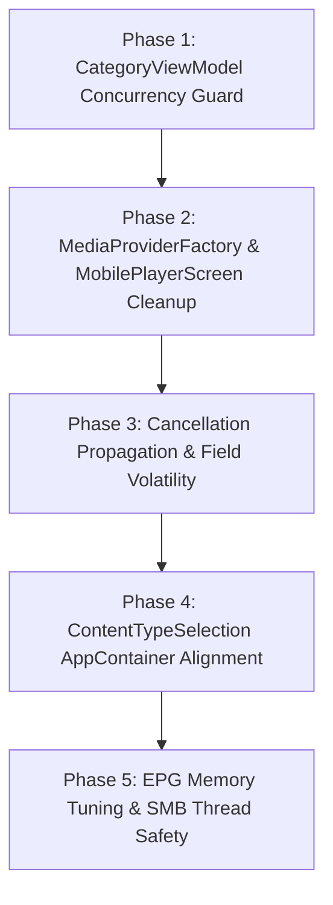

# Concurrency, Memory Pressure & Stability Remediation Plan

**Status:** Proposed  
**Date:** 2026-09-18  
**Scope:** `core:ui`, `core:network`, `core:player`, `tv`, `mobile`

---

## 1. Executive Summary

A deep-dive architectural audit conducted on 2026-09-18 identified 9 concrete stability and performance hazards across concurrency, memory allocation, and lifecycle management.

While the data layer (`xtream_v2.db`) and core playback engine have high durability, asynchronous UI state management and service/provider caching contain subtle race conditions and allocation leaks that induce UI jank, dropped frames, and state corruption on low-resource Android TV and mobile devices.

This plan details the verified root causes, concrete mechanisms, and a prioritized 5-phase remediation roadmap.

---

## 2. Findings & Root Cause Analysis

### Finding 1: Category Switching Race & State Clobbering in `CategoryViewModel`
* **Severity:** **P0 - Critical**
* **Location:** [`core/ui/src/main/java/org/njarasoa/fijerena/core/ui/viewmodels/CategoryViewModel.kt`](file:///home/tahiry/data/code/mpilasy/fijerena/core/ui/src/main/java/org/njarasoa/fijerena/core/ui/viewmodels/CategoryViewModel.kt#L287-L305)
* **Mechanism:** As a user navigates up or down the category list with the TV D-pad or mobile taps, `loadStreams(categoryId)` is called on every focus/selection change. `CategoryViewModel` maintains no active `Job` reference and lacks category-matching guards in its emission callbacks:
  1. If a user quickly navigates through categories $A \rightarrow B \rightarrow C$, three coroutines run concurrently on `viewModelScope`.
  2. If query $A$ completes after query $C$, $A$'s result calls `emitStreams()`, silently clobbering `_uiState.value`. The UI displays streams belonging to category $A$ while category $C$ is focused.
  3. In addition, `loadNowPlaying(items)` launches an unmanaged, uncancelled child coroutine per category switch, spawning competing SQLite lookups and Xtream API requests that race to overwrite `_nowPlaying.value`.
* **Remediation:**
  - Track `loadStreamsJob: Job?` and `nowPlayingJob: Job?`.
  - Cancel prior jobs before launching new queries.
  - Add guard `if (categoryId != currentCategoryId) return@launch` prior to emitting states.

---

### Finding 2: Thread-Unsafe Singleton Cache in `MediaProviderFactory`
* **Severity:** **P0 - Critical**
* **Location:** [`core/network/src/main/java/org/njarasoa/fijerena/core/network/MediaProviderFactory.kt`](file:///home/tahiry/data/code/mpilasy/fijerena/core/network/src/main/java/org/njarasoa/fijerena/core/network/MediaProviderFactory.kt#L30)
* **Mechanism:** `private val providerCache = mutableMapOf<Long, MediaProvider>()` uses a plain `LinkedHashMap` accessed across arbitrary threads with zero synchronization:
  - `create()` is called concurrently from background workers (`ProviderSyncRunner`), IO dispatchers (`AppContainer`), and screen composables.
  - `trimMemory()` iterates `providerCache.values.forEach { ... }` from Android's main thread via `FijerenaApplication.onTrimMemory`.
  - `clearCache()` and `clearAllCaches()` mutate the map directly.
  - **Risk:** Concurrent reads/writes to `LinkedHashMap` cause `ConcurrentModificationException` during memory pressure callbacks or internal bucket pointer corruption leading to infinite loops. A check-then-act race also produces duplicate provider instances.
* **Remediation:** Replace with `ConcurrentHashMap<Long, MediaProvider>` or guard all map mutations and iterations with a synchronization lock (`providerLock`).

---

### Finding 3: Zombie `PlaybackViewModel` Allocation in `MobilePlayerScreen`
* **Severity:** **P1 - High**
* **Location:** [`mobile/src/main/java/org/njarasoa/fijerena/feature/player/MobilePlayerScreen.kt`](file:///home/tahiry/data/code/mpilasy/fijerena/mobile/src/main/java/org/njarasoa/fijerena/feature/player/MobilePlayerScreen.kt#L99-L123)
* **Mechanism:** `MobilePlayerScreen` declares `viewModel: PlaybackViewModel = viewModel()` as a default parameter. Inside the composable body, it ignores this parameter and instantiates a second `activityScopedViewModel = viewModel(viewModelStoreOwner = activity)`.
  - Every player navigation allocates an unneeded backstack-scoped `PlaybackViewModel` that connects to `StreamingPlaybackService` and registers listeners.
  - When navigating back, the backstack-scoped ViewModel is popped and destroyed, calling `controller.stop()`, `serviceConnection.disconnect()`, and resetting `serviceStartRequested`.
  - **Impact:** Explains erratic lifecycle disconnects, dropped audio, and recomposition frame drops on player exit and re-entry on mobile.
* **Remediation:** Remove the default `viewModel: PlaybackViewModel = viewModel()` parameter; obtain and use only the activity-scoped ViewModel.

---

### Finding 4: Swallowed `CancellationException` in `EpgFileManager`
* **Severity:** **P1 - High**
* **Location:** [`core/network/src/main/java/org/njarasoa/fijerena/core/network/xmltv/EpgFileManager.kt`](file:///home/tahiry/data/code/mpilasy/fijerena/core/network/src/main/java/org/njarasoa/fijerena/core/network/xmltv/EpgFileManager.kt#L1188-L1240)
* **Mechanism:** In `downloadSource` (lines 1188 & 1235) and `ingestDownloadedSource` (line 1391), `catch (e: Exception)` blocks do not rethrow `CancellationException`.
  - When an EPG sync is cancelled by the user or timed out by WorkManager, `CancellationException` is caught as a network failure.
  - It records a false failure in the database (`sourceDao.markError`), retries up to 5 times with exponential backoff delays, and prevents graceful worker termination.
* **Remediation:** Enforce `if (e is CancellationException) throw e` at the entry of all catch blocks in `downloadSource` and `ingestDownloadedSource`.

---

### Finding 5: Cross-Thread Visibility Without `@Volatile`
* **Severity:** **P1 - High**
* **Locations:**
  - [`core/ui/src/main/java/org/njarasoa/fijerena/core/ui/viewmodels/SeriesDetailsViewModel.kt:25`](file:///home/tahiry/data/code/mpilasy/fijerena/core/ui/src/main/java/org/njarasoa/fijerena/core/ui/viewmodels/SeriesDetailsViewModel.kt#L25) (`private var repository: MediaRepository? = null`)
  - [`core/ui/src/main/java/org/njarasoa/fijerena/core/ui/viewmodels/MovieDetailsViewModel.kt:76`](file:///home/tahiry/data/code/mpilasy/fijerena/core/ui/src/main/java/org/njarasoa/fijerena/core/ui/viewmodels/MovieDetailsViewModel.kt#L76) (`private var mediaRepository: MediaRepository? = null`)
* **Mechanism:** These fields are written from `Dispatchers.IO` in `ensureRepo()`/`loadMovieDetail()`, but read on the Main UI thread by composables (e.g. [`EpisodeSelectionScreen.kt:218`](file:///home/tahiry/data/code/mpilasy/fijerena/tv/src/main/java/org/njarasoa/fijerena/feature/episode/EpisodeSelectionScreen.kt#L218): `mediaRepository = viewModel.mediaRepository!!`).
  - Without `@Volatile`, memory writes across CPU cores may not be visible immediately, causing `NullPointerException` crashes during rapid screen transitions.
* **Remediation:** Annotate repository fields with `@Volatile`.

---

### Finding 6: Unmanaged Duplicate Provider Creation in `ContentTypeSelectionScreen`
* **Severity:** **P2 - Medium**
* **Locations:**
  - [`tv/src/main/java/org/njarasoa/fijerena/feature/contentselection/ContentTypeSelectionScreen.kt:167`](file:///home/tahiry/data/code/mpilasy/fijerena/tv/src/main/java/org/njarasoa/fijerena/feature/contentselection/ContentTypeSelectionScreen.kt#L167)
  - [`mobile/src/main/java/org/njarasoa/fijerena/feature/contentselection/ContentTypeSelectionScreen.kt:128`](file:///home/tahiry/data/code/mpilasy/fijerena/mobile/src/main/java/org/njarasoa/fijerena/feature/contentselection/ContentTypeSelectionScreen.kt#L128)
* **Mechanism:** Both screens call `MediaProviderFactory.create(activeProvider, context, password)` directly on launch instead of retrieving the repository singleton from `AppContainer`.
  - Creates standalone `XtreamMediaProvider` instances with unmanaged background `writeScope` coroutines and separate OkHttp client connections.
* **Remediation:** Use `AppContainer.getInstance(context).getMediaRepository(activeProvider.id)` to reuse the existing managed repository and provider instance.

---

### Finding 7: Excessive Native RAM Allocation During EPG FTS Rebuild
* **Severity:** **P2 - Medium**
* **Location:** [`core/network/src/main/java/org/njarasoa/fijerena/core/network/xmltv/epgindex/EpgIndexer.kt:421-422`](file:///home/tahiry/data/code/mpilasy/fijerena/core/network/src/main/java/org/njarasoa/fijerena/core/network/xmltv/epgindex/EpgIndexer.kt#L421-L422)
* **Mechanism:** Rebuilding the SQLite FTS4 table issues `PRAGMA temp_store = MEMORY` and `PRAGMA cache_size = -64000` (64 MB).
  - For XMLTV files with 2M–4M programmes, sorting and indexing intermediate segments in RAM consumes 150MB+ of native process memory, risking Low Memory Killer (LMK) process termination on 1GB–2GB RAM Android TV devices.
* **Remediation:** Use `PRAGMA temp_store = FILE` on memory-constrained devices or scale `cache_size` down to `-16000` (16 MB).

---

### Finding 8: Unsynchronized Stream Teardown Race in `SmbClient`
* **Severity:** **P2 - Medium**
* **Location:** [`core/network/src/main/java/org/njarasoa/fijerena/core/network/smb/SmbClient.kt:88-101`](file:///home/tahiry/data/code/mpilasy/fijerena/core/network/src/main/java/org/njarasoa/fijerena/core/network/smb/SmbClient.kt#L88-L101)
* **Mechanism:** `disconnect()` closes and nulls out `share`, `session`, and `connection` under `synchronized(this)`. However, `openInputStream(path)` and `listDirectory(path)` access `share` outside synchronization.
  - If a user cancels playback or navigates away while a stream is opening, `openInputStream()` can attempt to operate on a closed or null share, throwing an unexpected exception.
* **Remediation:** Synchronize `openInputStream` and `listDirectory` or read a local volatile reference before delegating.

---

### Finding 9: Hot-Path Regex Compilation in DNS Resolution
* **Severity:** **P3 - Low**
* **Location:** [`core/player/src/main/java/org/njarasoa/fijerena/core/player/network/NetworkModule.kt:126`](file:///home/tahiry/data/code/mpilasy/fijerena/core/player/network/NetworkModule.kt#L126)
* **Mechanism:** `isIpAddress(hostname)` evaluates `Regex("""^(\d{1,3}\.){3}\d{1,3}$""")` on every DNS lookup call, recompiling the pattern repeatedly during image loading bursts.
* **Remediation:** Hoist the regex into a `private val IP_REGEX = Regex(...)` top-level constant.

---

## 3. Prioritized Phased Implementation Roadmap

### Phase 1: CategoryViewModel Concurrency Guards (P0 - Immediate)
* **Goal:** Eliminate split-pane state clobbering during rapid TV D-pad scrolling.
* **Tasks:**
  1. Add `private var loadStreamsJob: Job? = null` and `private var nowPlayingJob: Job? = null` in `CategoryViewModel`.
  2. In `loadStreams(categoryId)`: cancel `loadStreamsJob` before launching; verify `currentCategoryId == categoryId` before emitting.
  3. In `loadNowPlaying(items)`: cancel `nowPlayingJob` before launching.
* **Verification:** Rapid D-pad scrolling across category lists on TV emulator; verify selected category streams always match header.

### Phase 2: Cache Thread-Safety & Mobile Lifecycle Fixes (P0 - Immediate)
* **Goal:** Prevent `ConcurrentModificationException` during memory pressure and eliminate zombie viewmodel teardown.
* **Tasks:**
  1. In `MediaProviderFactory.kt`, replace `mutableMapOf` with `ConcurrentHashMap<Long, MediaProvider>()` and guard mutations with a synchronized block.
  2. In `mobile/.../MobilePlayerScreen.kt`, remove the default argument `viewModel: PlaybackViewModel = viewModel()` and use `activityScopedViewModel` directly.
* **Verification:** Verify mobile player enters and exits cleanly without stopping playback prematurely or dropping frames.

### Phase 3: Cancellation Propagation & Field Volatility (P1)
* **Goal:** Ensure cooperative coroutine cancellation and safe cross-thread memory visibility.
* **Tasks:**
  1. In `EpgFileManager.kt`, add `if (e is CancellationException) throw e` to catch blocks in `downloadSource` and `ingestDownloadedSource`.
  2. Annotate `SeriesDetailsViewModel.repository` and `MovieDetailsViewModel.mediaRepository` with `@Volatile`.
* **Verification:** Cancel an in-flight EPG refresh; verify sources are not marked as errored in the database.

### Phase 4: Content Selection AppContainer Alignment (P1)
* **Goal:** Prevent duplicate unmanaged provider instances on screen launch.
* **Tasks:**
  1. Refactor TV and mobile `ContentTypeSelectionScreen.kt` to obtain providers via `AppContainer.getMediaRepository()`.
  2. Verify backdrop and category count queries execute against cached repository state.
* **Verification:** Verify no duplicate network sessions or OkHttp clients created on screen entry.

### Phase 5: EPG Memory Tuning & SMB Synchronization (P2)
* **Goal:** Reduce native memory footprint during FTS indexing and eliminate SMB disconnect crashes.
* **Tasks:**
  1. In `EpgIndexer.rebuildFtsAndUpdateState()`, adjust `PRAGMA temp_store` and reduce page cache allocation to 16MB.
  2. In `SmbClient.kt`, synchronize directory listing and stream opening against `this`.
  3. In `NetworkModule.kt`, hoist `IP_REGEX` to a singleton pattern.
* **Verification:** Run EPG full rebuild on TV device; monitor memory RSS.

---

## 4. Quality Gates & Verification Standards

Every phase must satisfy:
1. `./gradlew ktlintCheck` — zero style regressions.
2. `./gradlew testDebugUnitTest` — 199+ unit tests pass.
3. `./gradlew assembleDebug` — successful compilation for both mobile and TV targets.
4. Single-return statement adherence and token-based styling.
